# Docker y GitLab por dentro

Esta es la versión escrita de todo lo que se ve en la sesión 10, más las partes de CI/CD que no caben en dos horas de clase. No hace falta leerla entera antes, pero si la lees vas a llegar con las preguntas hechas en vez de tomando notas.

Al final hay un glosario.

---

## 1. El problema que resuelve

Durante nueve sesiones te has topado con errores que no eran de tu código:

```
Node: 22.23.2 (Unsupported)
Bind for 0.0.0.0:8082 failed: port is already allocated
django.db.utils.OperationalError: connection to server at "127.0.0.1", port 5432 failed
```

Los tres son la computadora, no el programa. Qué versión tiene instalada, qué puerto está ocupado, qué servicio está corriendo. El proyecto espera una versión y cada computadora trae la suya, más nueva o más vieja, y nadie tiene la culpa.

Docker cambia de sitio esas tres cosas. La versión, el puerto y los servicios dejan de depender de tu computadora y pasan a estar **escritos en tu repositorio**, iguales para todos.

Y no es nuevo para ti: desde la sesión 1 tu proyecto corre dentro de un contenedor. El `devcontainer.json` dice `"image": "mcr.microsoft.com/devcontainers/php:8.3-bookworm"`, pide Node 22 y reenvía los puertos 8000 y 5173. Eso es una imagen, un contenedor y una publicación de puertos. Lo único que cambia hoy es que pasas de usarlo a escribirlo.

## 2. Para qué se usa Docker

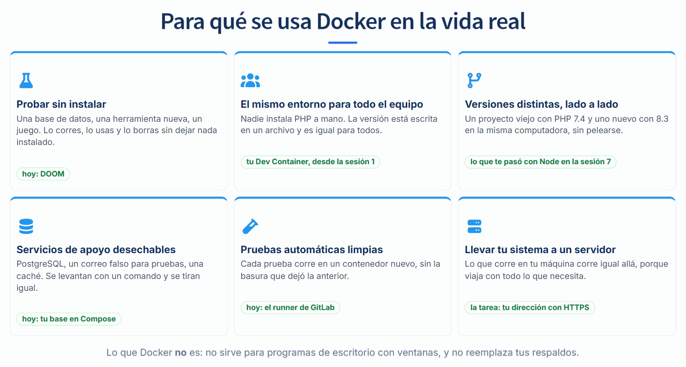

Antes de entrar en cómo funciona, conviene saber dónde se usa. Son seis usos, del más chico al más grande, y los seis los vas a tocar en esta sesión:

| Para qué | Qué resuelve | Dónde lo ves en el curso |
|---|---|---|
| **Probar sin instalar** | Corres una base de datos, una herramienta o un juego, lo usas y lo borras sin dejar nada instalado | DOOM, en el bloque 1 |
| **El mismo entorno para todo el equipo** | Nadie instala PHP a mano: la versión está escrita en un archivo y es igual para todos | Tu Dev Container, desde la sesión 1 |
| **Versiones distintas, lado a lado** | Un proyecto viejo con PHP 7.4 y uno nuevo con 8.3 en la misma computadora, sin pelearse | Lo que te pasó con Node en la sesión 7 |
| **Servicios de apoyo desechables** | PostgreSQL, un correo falso para pruebas, una caché: se levantan con un comando y se tiran igual | Tu base en Compose, en el bloque 3 |
| **Pruebas automáticas limpias** | Cada prueba corre en un contenedor nuevo, sin la basura que dejó la anterior | El runner de GitLab, en el bloque 4 |
| **Llevar tu sistema a un servidor** | Lo que corre en tu máquina corre igual allá, porque viaja con todo lo que necesita | La tarea: tu dirección con HTTPS |

Y lo que **no** es:

- **No sirve para programas de escritorio con ventanas.** Docker corre programas de terminal y servidores. Un juego como DOOM funciona porque lo sirve una página web.
- **No reemplaza tus respaldos.** Un volumen se borra con un comando, como vas a ver en la sección de volúmenes. Respaldar es otra cosa, y queda fuera de este curso.

## 3. Máquina virtual y contenedor

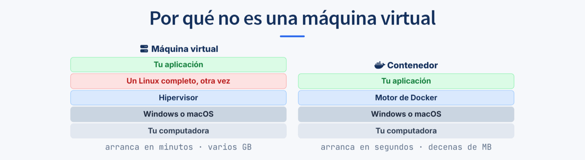

Las dos aíslan cosas, pero no de la misma manera.

Una **máquina virtual** arranca un sistema operativo completo encima del que ya tienes. Si tu computadora corre Windows y quieres un Linux, la máquina virtual levanta un Linux entero: su propio arranque, sus propios procesos, su propia memoria reservada. Por eso tarda minutos y pesa gigas.

Un **contenedor** no hace eso. Usa el núcleo del sistema que ya está corriendo y solo separa los procesos: cada contenedor cree que tiene la máquina para él solo, pero por debajo comparten el mismo sistema. Por eso arranca en segundos y pesa decenas de megas.

Un detalle que conviene tener claro: en Windows y en Mac, Docker **sí** levanta una máquina virtual chica con Linux adentro, porque los contenedores de Linux necesitan un núcleo de Linux. Pero es una sola, compartida por todos tus contenedores, y la administra Docker Desktop sin que tú la veas.

## 4. Ocho palabras

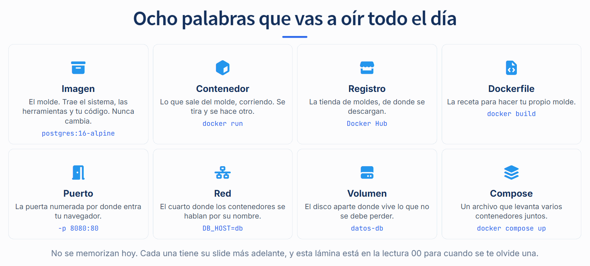

Son las que más vas a oír. No hace falta memorizarlas: cada una tiene su sección más abajo. Esta tabla es para volver cuando se te olvide una.

| Palabra | Qué es, en una frase | Ejemplo |
|---|---|---|
| **Imagen** | El molde: el sistema, las herramientas y tu código, congelados. No cambia; se reemplaza por otra | `postgres:16-alpine` |
| **Contenedor** | Lo que sale del molde, corriendo. Se tira y se hace otro | Lo que crea `docker run` |
| **Registro** | La tienda de moldes, de donde se descargan | Docker Hub |
| **Dockerfile** | La receta para hacer tu propio molde | `docker/angular.Dockerfile` |
| **Puerto** | La puerta numerada por donde entra tu navegador | `-p 8080:80` |
| **Red** | El cuarto donde los contenedores se hablan por su nombre | `DB_HOST=db` |
| **Volumen** | El disco aparte donde vive lo que no se debe perder | `datos-db` |
| **Compose** | Un archivo que levanta varios contenedores juntos | `compose.yaml` |

## 5. Imagen y contenedor

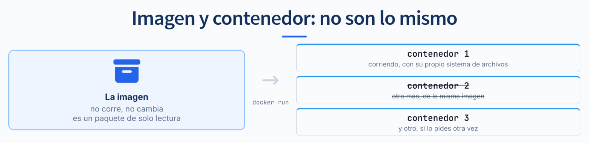

Son dos cosas distintas y se confunden todo el tiempo.

La **imagen** es un paquete de solo lectura: el sistema, las herramientas y tu código, congelados. No corre. No se modifica; se reemplaza por otra.

El **contenedor** es una imagen en ejecución. `docker run` crea uno **nuevo** cada vez, no reanuda el anterior. Puedes tener varios vivos al mismo tiempo de la misma imagen, sin que se estorben.

De ahí sale la consecuencia que más sorprende la primera vez: **cuando borras un contenedor, se va todo lo que escribió adentro**. La imagen sigue intacta, pero lo que el programa guardó mientras corría, no. Por eso lo que quieras conservar tiene que vivir fuera, en un volumen, que es la sección 19.

## 6. Las capas

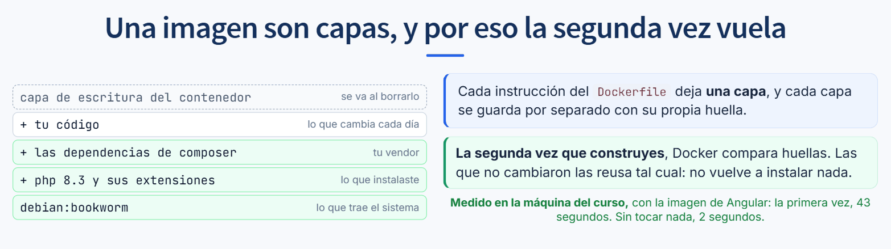

Cada instrucción de un `Dockerfile` deja una **capa**, y cada capa se guarda por separado con su propia huella. Una imagen no es un archivo grande: es una pila de capas.

```
+ capa de escritura del contenedor   se va al borrarlo
+ tu codigo                          cambia cada dia
+ las dependencias                   cambian de vez en cuando
+ php 8.3 y sus extensiones          casi nunca cambian
debian:bookworm                      la base
```

Cuando vuelves a construir, Docker compara huellas capa por capa. Las que no cambiaron las reusa tal cual, sin ejecutar nada. En cuanto una cambia, esa y **todas las de arriba** se rehacen.

De ahí sale la regla que vas a usar todo el día: **lo que no cambia va abajo, lo que cambia va arriba**. El orden de las líneas es una decisión de velocidad, no de estilo.

## 7. Cliente, demonio y registro

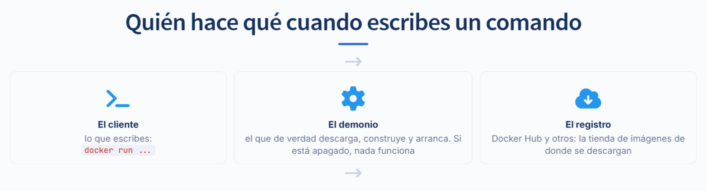

Cuando escribes `docker run`, hay tres piezas trabajando.

**El cliente** es lo que escribes en la terminal. No hace el trabajo: lo pide.

**El demonio** es un programa que vive corriendo en tu máquina y es el que de verdad descarga, construye y arranca. Es lo que enciende Docker Desktop. Cuando ves `Cannot connect to the Docker daemon`, es que está apagado: el cliente está bien, el servicio no.

**El registro** es la tienda de imágenes. Docker Hub es el que viene por defecto, y por eso `docker run nginx` funciona sin que le digas de dónde bajarla. GitLab trae el suyo, y ahí es donde acaban las imágenes de los proyectos de verdad.

Los tres son piezas separadas, y por eso pueden vivir en lugares distintos. En Windows y en Mac, Docker Desktop corre el demonio dentro de una pequeña máquina virtual de Linux, y tu terminal le habla desde afuera.

Así se ve todo junto cuando corres DOOM: el demonio busca la imagen, la pide al registro, crea el contenedor, lo conecta a una red y abre el puerto hacia tu navegador.

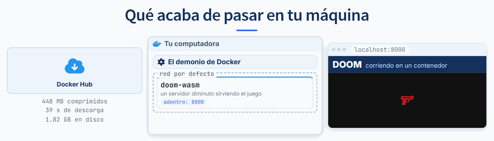

## 8. Qué es un puerto

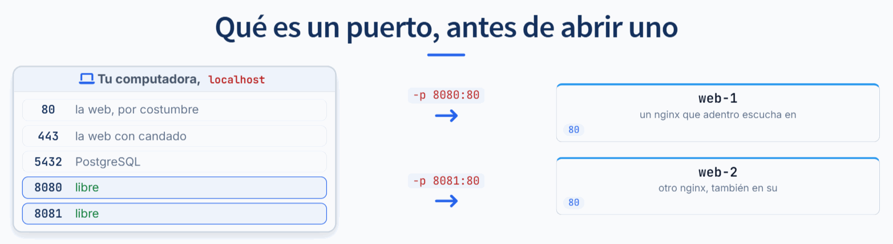

Tu computadora tiene **una sola dirección**, pero **65 535 puertas numeradas**: los puertos. Es como un edificio con una dirección en la calle y muchos departamentos. Un programa que espera visitas se para detrás de una puerta y escucha.

Hay puertas que se usan por costumbre:

| Puerto | Quién suele estar ahí |
|---|---|
| 80 | Un servidor web |
| 443 | Un servidor web con HTTPS, el del candado |
| 5432 | PostgreSQL |
| 8000 | `php artisan serve` y otros servidores de desarrollo |
| 4200 | `ng serve` de Angular |

**Dos programas no pueden usar la misma puerta en la misma computadora.** El segundo recibe un error.

**Un contenedor es como otra casa**, con sus propias puertas. El nginx de adentro escucha en **su** 80, aunque tu computadora tenga ocupado su propio 80: son puertas de casas distintas. Pero esa casa no tiene ninguna puerta hacia la calle, así que tu navegador no la alcanza.

**`-p 8080:80` abre un pasillo**: quien toque la puerta 8080 de tu computadora llega a la 80 del contenedor. Se lee siempre igual: **izquierda, tu computadora; derecha, el contenedor.**

Por eso dos contenedores iguales pueden correr juntos si les das puertas distintas por fuera:

```
docker run -d --name web1 -p 8080:80 nginx:1.27-alpine
docker run -d --name web2 -p 8081:80 nginx:1.27-alpine
```

Y si repites la de afuera, Docker lo dice así:

```
Bind for 0.0.0.0:8080 failed: port is already allocated
```

La solución es siempre cambiar el número de la **izquierda**. El de la derecha lo decide el programa de adentro y no se toca.

Para saber qué ocupa un puerto en tu máquina:

| Dónde | Comando |
|---|---|
| Contenedores | `docker ps`, columna `PORTS` |
| Windows, en PowerShell | `Get-NetTCPConnection -LocalPort 8080`. Si dice que no encontró nada, está libre |
| Mac o Linux | `lsof -i :8080` |


## 9. Lo que le puedes agregar a `docker run`

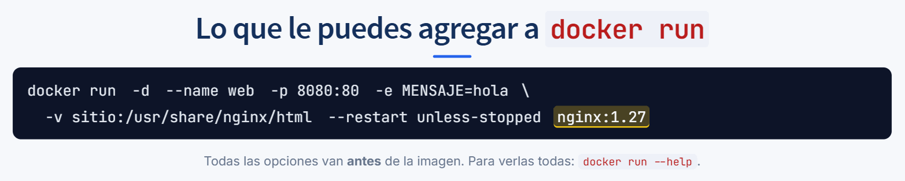

Un `docker run` completo se ve así. Todas las opciones van **antes** de la imagen:

```
docker run -d --name web -p 8080:80 -e MENSAJE=hola -v sitio:/usr/share/nginx/html --restart unless-stopped nginx:1.27
```

| Opción | Qué hace | Cuándo la usas |
|---|---|---|
| `-d` | Corre en segundo plano y te devuelve la terminal | Casi siempre, salvo que quieras ver la salida en vivo |
| `--name web` | Le pone un nombre tuyo | Para pararlo o ver sus logs sin buscar el nombre que inventa Docker |
| `-p 8080:80` | Abre un pasillo de tu puerto al de adentro | Cuando algo de afuera, como tu navegador, tiene que entrar |
| `-e MENSAJE=hola` | Le pasa una variable de entorno | Para configurar sin tocar la imagen: contraseñas, nombres de base |
| `-v sitio:/ruta` | Conecta un volumen en una carpeta de adentro | Para que los datos sobrevivan al contenedor |
| `-v ./sitio:/ruta` | Mete una carpeta tuya adentro | En desarrollo, para ver tus cambios al instante |
| `--restart unless-stopped` | Lo vuelve a levantar si se cae o si la máquina reinicia | En un servidor |
| `--rm` | Lo borra al terminar | Para pruebas, como DOOM, sin dejar basura |
| `-it` | Te da una terminal interactiva | `docker run -it --rm alpine:3.20 sh` para curiosear adentro |
| `--network interna` | Lo conecta a una red | Para que vea a otros contenedores por su nombre |

Lo que va **después** de la imagen no es una opción: es el comando que corre adentro, en lugar del que trae la imagen.

```
docker run --rm alpine:3.20 echo "hola desde adentro"
```

Por eso el error más común de sintaxis es poner una opción al final. Esto:

```
docker run --rm nginx:1.27-alpine -p 8080:80
```

no publica nada: le pasa `-p` a nginx, que contesta `exec: line 47: illegal option -p`. Si ves un error raro que menciona una opción de Docker, revisa que esté antes del nombre de la imagen.

Para ver todas las opciones: `docker run --help`.


## 10. Más comandos, según lo que quieras hacer

Todos siguen el mismo patrón: `docker`, qué cosa, qué hacerle. Y cualquier comando acepta `--help`.

| Quiero... | Escribo |
|---|---|
| Ver qué está corriendo | `docker ps` |
| Ver también los apagados | `docker ps -a` |
| Leer lo que imprimió un contenedor | `docker logs -f web` |
| Meterme adentro | `docker exec -it web sh` |
| Descargar una imagen sin correrla | `docker pull postgres:16-alpine` |
| Construir mi propia imagen | `docker build -t mi-app .` |
| Parar, arrancar o reiniciar | `docker stop web`, `docker start web`, `docker restart web` |
| Borrar un contenedor o una imagen | `docker rm web`, `docker rmi nginx:1.27` |
| Ver mis volúmenes y mis redes | `docker volume ls`, `docker network ls` |
| Ver todo sobre un contenedor | `docker inspect web` |
| Sacar un archivo de adentro | `docker cp web:/etc/nginx/nginx.conf .` |
| Ver memoria y CPU en vivo | `docker stats` |
| Ver cuánto disco ocupa Docker | `docker system df` |
| Liberar disco | `docker system prune`. Pregunta antes de borrar: lee lo que te pregunta |

`docker images` en las versiones recientes muestra dos tamaños: `DISK USAGE`, lo que ocupa en tu disco, y `CONTENT SIZE`, lo que se descarga comprimido. Los números de esta lectura son del primero.

## 11. El Dockerfile

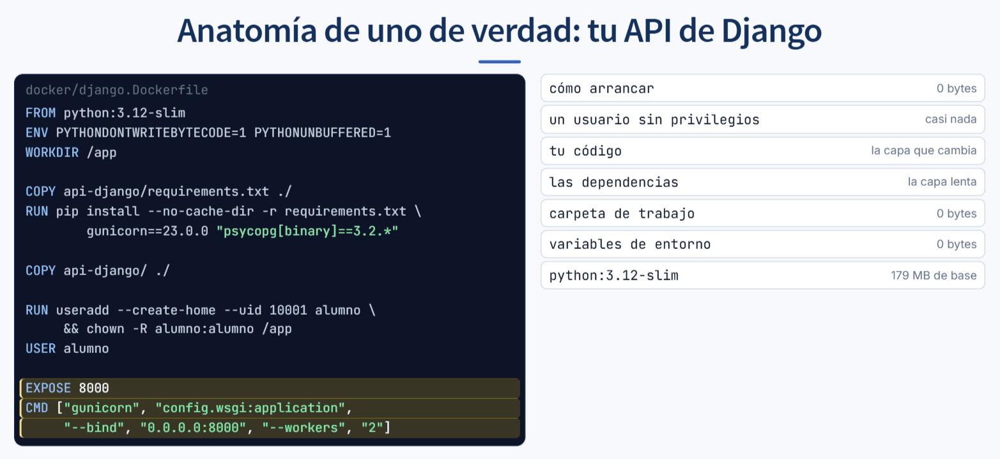

Es el instructivo de instalación que ya escribías en un README, en un formato que una máquina puede seguir.

```dockerfile
FROM python:3.12-slim
ENV PYTHONDONTWRITEBYTECODE=1 PYTHONUNBUFFERED=1
WORKDIR /app
COPY api-django/requirements.txt ./
RUN pip install --no-cache-dir -r requirements.txt gunicorn==23.0.0 "psycopg[binary]==3.2.*"
COPY api-django/ ./
RUN useradd --create-home --uid 10001 alumno && chown -R alumno:alumno /app
USER alumno
EXPOSE 8000
CMD ["gunicorn", "config.wsgi:application", "--bind", "0.0.0.0:8000"]
```

| Instrucción | Qué hace |
|---|---|
| `FROM` | De qué imagen partes. Siempre es lo primero. Nunca empiezas de cero. |
| `ENV` | Variables para todo lo que corra adentro. |
| `WORKDIR` | El `cd` del Dockerfile. Además crea la carpeta si no existe. |
| `COPY` | Trae archivos de tu carpeta a la imagen. Izquierda tu máquina, derecha la imagen. |
| `RUN` | Ejecuta un comando **al construir**, y lo que deje queda en la imagen. |
| `USER` | Con qué usuario corre lo de aquí en adelante. |
| `EXPOSE` | Documenta por dónde escucha. **No abre nada.** |
| `CMD` | Qué se ejecuta al arrancar el contenedor. |

Dos que se confunden seguido:

**`RUN` contra `CMD`.** `RUN` pasa mientras se construye la imagen; `CMD` pasa cuando arranca el contenedor. Un `RUN pip install` deja las dependencias dentro de la imagen. Un `CMD ["gunicorn", ...]` no se ejecuta hasta que alguien corre el contenedor.

**`EXPOSE` no abre puertos.** Es documentación. Quien abre la puerta de verdad es el `-p` de `docker run` o el `ports:` de Compose. Un contenedor con `EXPOSE 80` y sin `-p` corre igual, pero nadie de fuera lo alcanza.

Sobre `USER`: por defecto, dentro del contenedor eres root. Si alguien se cuela por un agujero de tu aplicación, mejor que llegue como un usuario que no puede nada. Son dos líneas.

Y sobre el `CMD`: en producción no se usa el servidor de desarrollo. Ni `manage.py runserver` de Django, ni `ng serve` de Angular, ni `php artisan serve`. Los tres avisan en su propia salida que no sirven para eso. Se usa `gunicorn`, o nginx sirviendo archivos, o Apache con PHP.

### Leer lo que imprime `docker build`

```
docker build -f docker/django.Dockerfile -t mi-django .
 => [1/6] FROM python:3.12-slim                     12.4s
 => [2/6] WORKDIR /app                               0.1s
 => [3/6] COPY api-django/requirements.txt ./        0.0s
 => [4/6] RUN pip install ...                       18.2s
 => [5/6] COPY api-django/ ./                        0.2s
 => [6/6] RUN useradd ...                            0.6s
 => exporting to image                               1.1s
```

- `[4/6]` es el paso 4 de 6, en el mismo orden que tu archivo. Las líneas que no tocan archivos, como `ENV`, `USER` o `CMD`, no llevan número.
- El tiempo de la derecha te dice cuál es la línea cara. Aquí, el `pip install`.
- Cuando en vez del tiempo dice `CACHED`, ese paso no se ejecutó: se reusó.
- Si truena, el número te dice en qué línea fue. No hay que adivinar.
- `-t` es el nombre que le pones. Sin él, la imagen queda sin nombre y la pierdes entre las demás.
- El punto del final es la carpeta que Docker puede leer al construir. Un `COPY` de algo que está fuera de esa carpeta no lo encuentra.

## 12. La caché y el orden de las líneas

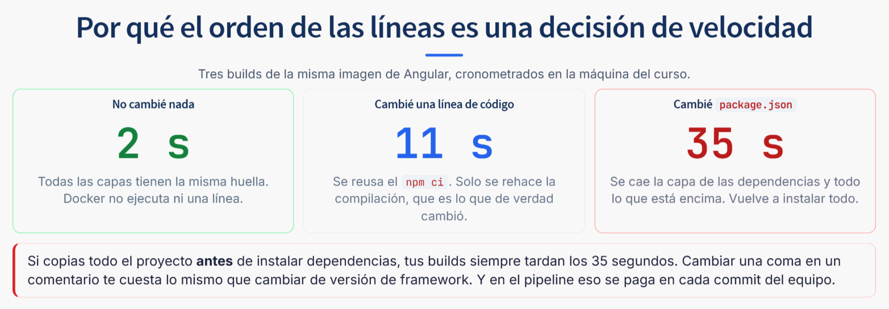

Esto se mide. Tres builds de la misma imagen de Angular, cronometrados:

| Qué cambió | Cuánto tardó |
|---|---|
| Nada | 2 segundos |
| Una línea de código fuente | 11 segundos |
| `package.json` | 35 segundos |

La diferencia está en dónde cae el corte. Con el archivo bien ordenado:

```dockerfile
COPY frontend/package.json frontend/package-lock.json ./
RUN npm ci
COPY frontend/ ./
RUN npm run build
```

Cambiar código no toca el `npm ci`, porque esa capa depende solo de los dos archivos de dependencias. Si en cambio copias todo antes:

```dockerfile
COPY frontend/ ./
RUN npm ci
RUN npm run build
```

entonces cualquier cambio, hasta una coma en un comentario, invalida el `COPY` y con él el `npm ci`. Todos tus builds tardan lo que tardaba el caso lento, y en el pipeline eso se paga en cada commit del equipo.

## 13. `.dockerignore`

Docker empieza mandando la carpeta entera al demonio. Sin este archivo, manda tus `node_modules` y tu `vendor` cada vez, aunque el Dockerfile no los copie.

```
**/node_modules
**/vendor
**/.git
**/.env
**/.env.*
!**/.env.example
```

Tres razones, y la tercera es la que importa:

1. **Velocidad.** Lo que no se manda, no se espera.
2. **Tamaño.** Lo que copias, pesa, y lo que pesa viaja en cada despliegue.
3. **Seguridad.** Una imagen se comparte. Un `.env` dentro de una imagen es una contraseña publicada, y borrarla después no sirve: se queda en la capa.

Que un archivo esté en `.gitignore` **no** lo protege de un `COPY`. Son dos listas distintas y hay que escribir las dos.

## 14. Multietapa

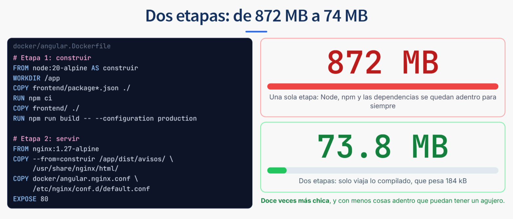

Un `Dockerfile` puede tener varios `FROM`. Cada uno empieza una etapa nueva, y solo la última se queda como imagen final.

```dockerfile
FROM node:20-alpine AS construir
WORKDIR /app
COPY frontend/package*.json ./
RUN npm ci
COPY frontend/ ./
RUN npm run build -- --configuration production

FROM nginx:1.27-alpine
COPY --from=construir /app/dist/avisos/ /usr/share/nginx/html/
EXPOSE 80
```

La primera etapa necesita Node, npm y varios cientos de dependencias para compilar. La segunda solo necesita servir archivos. `COPY --from` es el puente: va por lo que dejó la etapa anterior y se trae **nada más eso**.

Medido: **872 MB** en una sola etapa, **73.8 MB** en dos. La aplicación compilada pesa 184 kB; el resto de los 73.8 MB es nginx.

Y hay una ganancia que no se ve en el número: lo que no viaja tampoco se puede romper. En la imagen final no hay Node, ni npm, ni tu código fuente.

### Lo que suele fallar al construir, y qué significa

| Lo que dice | Lo que pasó de verdad |
|---|---|
| `Cannot connect to the Docker daemon` | Docker Desktop no está abierto. No es tu Dockerfile. |
| `failed to compute cache key: "/x" not found` | Un `COPY` apunta a algo que no existe, que está fuera de la carpeta del punto final, o que `.dockerignore` está bloqueando. |
| `npm ci` ... `package-lock.json` not found | Copiaste `package.json` pero no el lock. `npm ci` necesita los dos. |
| `port is already allocated` | Otra cosa ocupa ese puerto de tu máquina. Cambia el número de la izquierda del `-p`; el de adentro no. |
| `exec format error` | La imagen es para otro procesador. El caso típico: una imagen hecha en una Mac con chip Apple, corriendo en un servidor Intel o AMD. |
| El contenedor arranca y se apaga solo | El proceso del `CMD` terminó. `docker logs` casi siempre ya tiene la razón escrita. |

## 15. YAML en un minuto

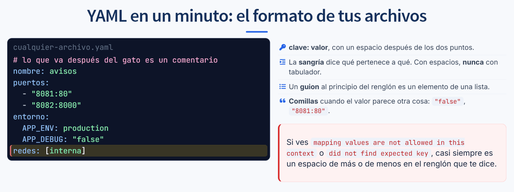

`compose.yaml` y `.gitlab-ci.yml` están escritos en YAML. Es un formato para escribir datos con sangría, y tiene cuatro reglas:

1. **`clave: valor`**, con un espacio después de los dos puntos.
2. **La sangría dice qué pertenece a qué.** Lo que está más adentro le pertenece a lo de arriba. Se hace con **espacios, nunca con tabulador**. En el curso van de dos en dos.
3. **Un guion al principio del renglón** es un elemento de una lista.
4. **Comillas** cuando el valor parece otra cosa. `"false"` con comillas es un texto; sin comillas, YAML lo toma como falso. `"8081:80"` sin comillas se puede leer como un número raro.

```yaml
# lo que va después del gato es un comentario
nombre: avisos
puertos:
  - "8081:80"
  - "8082:8000"
entorno:
  APP_ENV: production
  APP_DEBUG: "false"
redes: [interna]
```

La última línea es una lista corta en un renglón. `redes: [interna]` es lo mismo que escribir `redes:` y abajo `  - interna`.

Los errores de YAML casi siempre son un espacio de más o de menos, y el mensaje no ayuda mucho:

```
yaml: line 12: mapping values are not allowed in this context
yaml: line 8: did not find expected key
```

Ve al renglón que dice, y al de arriba. Compara la sangría con la de sus vecinos. Si `APP_ENV` quedó a la altura de `entorno` en vez de dos espacios más adentro, ya no le pertenece.

## 16. Compose

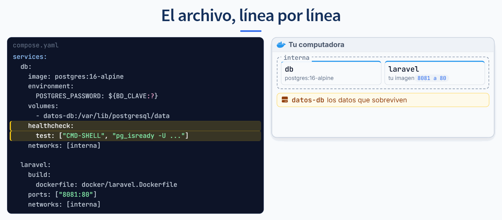

Una imagen sola no es un sistema. Tu proyecto son cuatro cosas hablando entre ellas, y levantarlas a mano son cuatro comandos larguísimos con contraseñas en el historial de la terminal.

`compose.yaml` los escribe una vez:

```yaml
services:
  db:
    image: postgres:16-alpine
    environment:
      POSTGRES_PASSWORD: ${BD_CLAVE:?}
    volumes:
      - datos-db:/var/lib/postgresql/data
    networks: [interna]

  laravel:
    build:
      dockerfile: docker/laravel.Dockerfile
    ports: ["8081:80"]
    networks: [interna]

networks:
  interna:
volumes:
  datos-db:
```

Cada nombre bajo `services` es un contenedor, y ese nombre además es **su dirección en la red**.

**`image` contra `build`.** `image` descarga algo que ya existe; `build` construye tu `Dockerfile`. Para la base de datos nunca se escribe un Dockerfile propio: se usa la oficial.

### Tu proyecto completo, en un archivo

| Servicio | Qué corre | Puerto en tu máquina | Tamaño medido |
|---|---|---|---|
| `angular` | nginx sirviendo tu `dist/` | 8080 | 73.8 MB |
| `laravel` | PHP 8.3 con Apache | 8081 | 932 MB |
| `django` | gunicorn | 8082 | 266 MB |
| `db` | PostgreSQL 16, con dos bases adentro | ninguno | la imagen oficial, descargada |

Construir las tres imágenes desde cero tardó 97 segundos en la máquina del curso. Después, segundos.

Es **un solo** PostgreSQL con **dos bases de datos** adentro, una para Laravel y otra para Django: menos contenedores, menos memoria, y la misma separación. La segunda base la crea `docker/postgres/crear-bases.sql`, y ese archivo tiene una trampa: **solo corre la primera vez que nace el volumen**. Si el volumen ya existe, PostgreSQL no lo vuelve a leer. Para que corra otra vez hay que borrar el volumen, con `down -v`, y eso borra también los datos.

### Los comandos de Compose

| Comando | Qué hace, y cuándo |
|---|---|
| `docker compose up -d` | Levanta todo en segundo plano. Con `--build` además reconstruye lo que cambió. |
| `docker compose ps` | Quién está arriba y quién está `healthy`. Lo primero que se mira. |
| `docker compose logs -f laravel` | Lo que imprime un servicio, en vivo. Sin nombre, los de todos mezclados. |
| `docker compose exec laravel php artisan migrate` | Un comando adentro de un contenedor que ya corre. |
| `docker compose down` | Apaga y borra contenedores y red. Los datos se quedan. |
| `docker compose down -v` | Lo mismo, y además borra los volúmenes. Los datos se van. |
| `docker compose config` | Te muestra el archivo ya resuelto, con las variables puestas. Para ver qué entendió de verdad. |

## 17. Redes: quién ve a quién

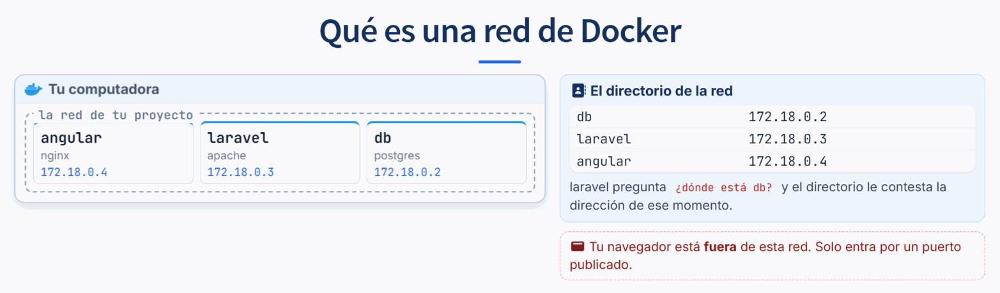

**Qué es una red, desde cero.** Cada contenedor nace aislado: sus propios archivos, sus propios procesos y su propia tarjeta de red. Solo, no ve a nadie. Una red de Docker es un cable virtual que une a varios, y adentro cada uno recibe su dirección IP, como las computadoras de tu casa en tu módem.

Esas IP cambian cada vez que se recrea un contenedor, así que nadie las escribe. La red trae un **directorio de nombres**: preguntas por `db` y te contesta la IP de ese momento. Lo puedes ver tú mismo:

```
docker compose exec laravel getent hosts db
172.22.0.2      db
```

Tu número va a ser otro, y cambia si recreas el contenedor. El nombre no cambia nunca, y por eso tu configuración dice `DB_HOST=db`.

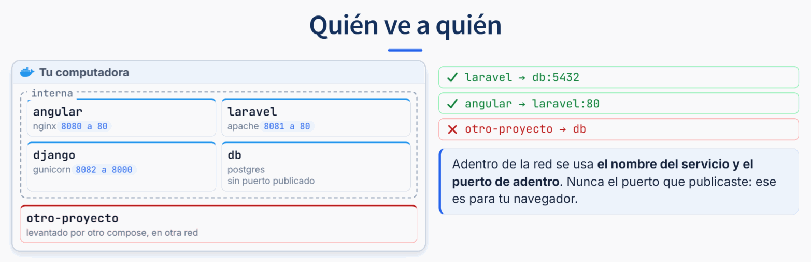

Compose crea una red para el proyecto y mete dentro a todos los servicios. Adentro hay un pequeño servicio de nombres: `db` se traduce a la dirección del contenedor de la base.

Lo que está en la misma red se ve por su nombre. Lo que no está, no existe. Un contenedor de otro proyecto, aunque esté en la misma computadora, no ve nada.

De ahí el error más común de todos:

**`localhost` no es el mismo para todos.**

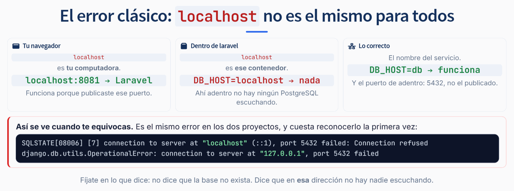

| Desde dónde | Qué significa `localhost` |
|---|---|
| Tu navegador | Tu computadora. `localhost:8081` llega a Laravel porque publicaste ese puerto. |
| Dentro del contenedor de Laravel | Ese contenedor. Ahí no hay ningún PostgreSQL escuchando. |
| Lo correcto en `compose.yaml` | El nombre del servicio: `DB_HOST: db`, y el puerto de adentro, `5432`. |

Así se ve cuando te equivocas, y es el mismo error con dos acentos:

```
SQLSTATE[08006] [7] connection to server at "localhost" (::1), port 5432 failed:
Connection refused

django.db.utils.OperationalError: connection to server at "127.0.0.1", port 5432 failed:
Connection refused
```

Léelo con atención: **no dice que la base no exista**. Dice que en esa dirección no hay nadie escuchando.

## 18. Puertos en Compose

`ports: ["8081:80"]` se lee de dos lados. El de la **izquierda** es el puerto de tu computadora; el de la **derecha**, el de adentro del contenedor.

Dos consecuencias prácticas:

- Si un puerto está ocupado, cambias el de la izquierda. El de la derecha lo decide la imagen y no se toca.
- Entre contenedores **no se usa el puerto publicado**. El nginx de Angular manda `/api/` a `laravel:80`, no a `laravel:8081`. El 8081 solo existe para ti.

Un servicio puede no publicar ningún puerto, y muchas veces así debe ser. La base de datos no tiene por qué ser alcanzable desde fuera: los contenedores que la necesitan la ven por la red interna.

En un servidor compartido no se publica **ninguno**, y la razón está en la sección 34.

## 19. Volúmenes: dónde viven los datos

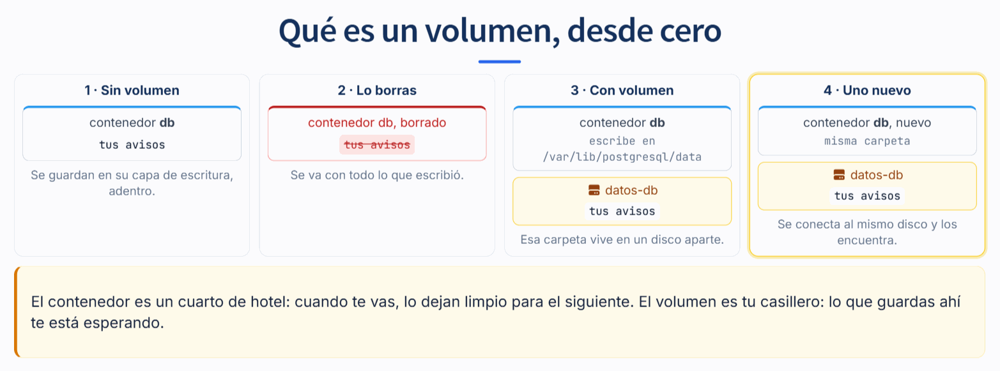

**Qué es un volumen, desde cero.** Todo lo que un contenedor escribe se queda adentro, en su capa de escritura. Cuando lo borras, se va con todo. No es una falla: los contenedores se hacen para tirarse y reemplazarse, y eso pasa en cada despliegue y en cada `docker compose down`.

Un volumen es un espacio de disco que Docker guarda aparte y conecta en una carpeta de adentro. El programa escribe como siempre, sin saber que esa carpeta vive afuera. El contenedor nuevo se conecta al mismo volumen y encuentra todo.

La analogía que sirve: el contenedor es un cuarto de hotel, que dejan limpio cuando te vas; el volumen es tu casillero, donde lo que guardas te espera. La regla sale sola: **lo que no quieres perder va en un volumen**. Bases de datos y archivos subidos, siempre.

Tus volúmenes se ven con `docker volume ls`. Compose les pone adelante el nombre del proyecto: el de `COMPOSE_PROJECT_NAME` en tu `.env`, o si no lo defines, el de tu carpeta. Con `COMPOSE_PROJECT_NAME=avisos-tunombre`:

```
local     avisos-tunombre_almacen-laravel
local     avisos-tunombre_datos-db
```

En `compose.yaml` se declaran así:

```yaml
    volumes:
      - datos-db:/var/lib/postgresql/data
```

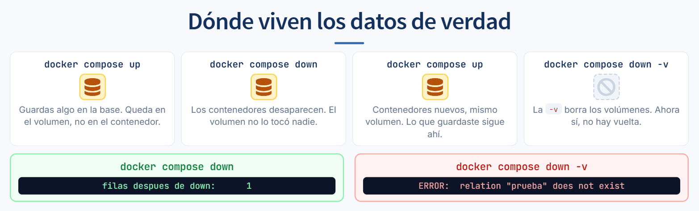

Lo que pasa con los comandos:

| Comando | Qué borra | Qué conserva |
|---|---|---|
| `docker compose down` | Contenedores y red | **Los volúmenes, con tus datos** |
| `docker compose down -v` | Contenedores, red **y volúmenes** | Nada |

Probado: escribir una fila, `down`, `up`, y sigue ahí. Después `down -v`, `up`:

```
ERROR:  relation "prueba" does not exist
```

No hay papelera. Los dos comandos se parecen en dos letras.

**Volumen con nombre contra bind mount.** Se reconocen a simple vista: si antes de los dos puntos hay un **nombre**, es un volumen que administra Docker; si hay una **ruta** que empieza con `./` o `/`, es una carpeta tuya de verdad.

- **Volumen con nombre** para datos: bases, archivos subidos. Va igual en tu máquina y en el servidor, y es rápido también en Windows y en Mac.
- **Bind mount** para desarrollo: guardas un archivo y el contenedor lo ve al instante. Es lo que hace tu Dev Container con el código. En producción no se usa: ahí el código va dentro de la imagen.

De ahí sale una pregunta útil cuando un cambio tuyo no se ve: **¿tu código está montado como carpeta, o está dentro de la imagen?** Si está dentro, hace falta reconstruir.

## 20. Arrancar en orden

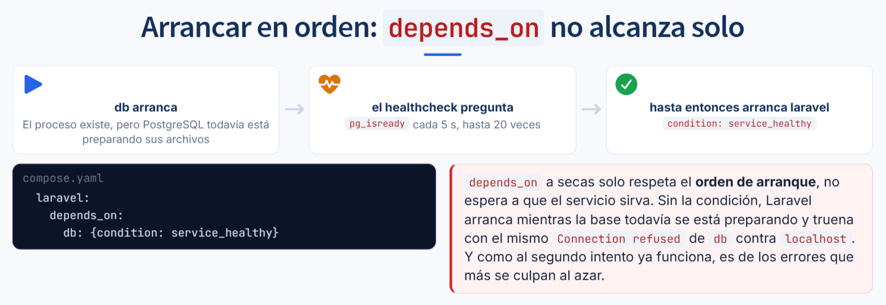

Que un contenedor esté "arriba" solo quiere decir que su proceso principal existe. PostgreSQL tarda unos segundos más en aceptar conexiones, y en esos segundos Laravel ya intentó conectarse y tronó.

```yaml
    healthcheck:
      test: ["CMD-SHELL", "pg_isready -U $$POSTGRES_USER -d $$POSTGRES_DB"]
      interval: 5s
      timeout: 3s
      retries: 20
```

El healthcheck es un comando que Compose corre adentro cada pocos segundos. Mientras falle, el servicio está `starting`; cuando pasa, queda `healthy`. Lo ves en `docker compose ps`.

Y entonces:

```yaml
    depends_on:
      db: {condition: service_healthy}
```

`depends_on` a secas solo respeta el **orden de arranque**, no espera a que el servicio sirva. Sin la condición, tienes errores que aparecen a veces sí y a veces no, según lo que tarde la base ese día. Son de los que más se culpan al azar.

## 21. Variables y secretos

La configuración entra por variables de entorno. Compose lee un archivo `.env` al lado del `compose.yaml` sin que le digas nada.

```
BD_USUARIO=avisos
BD_CLAVE=una_clave_larga_sin_espacios
PUERTO_LARAVEL=8081
```

Dos archivos, y solo uno se sube:

- **`.env`** tiene los valores de verdad. Está en `.gitignore` y en `.dockerignore`. En este proyecto es **el mismo `.env` de Laravel**: Compose lee ese archivo, así que la configuración vive en un solo lugar.
- **Un archivo de ejemplo** tiene los mismos nombres con valores de mentira. Ese sí se sube, y es lo que le dice a quien clona el proyecto qué hace falta. Aquí son dos: el `.env.example` que trae Laravel y el `docker/variables.env.example` de esta sesión.

La sintaxis que conviene conocer:

| Forma | Qué hace |
|---|---|
| `${BD_USUARIO}` | Usa la variable. Si falta, queda vacía y el error aparece después. |
| `${BD_CLAVE:?}` | Si falta, **Compose se niega a arrancar**. Mejor fallar al principio. |
| `${PUERTO_LARAVEL:-8081}` | Si falta, usa 8081. Para lo que tiene un valor razonable por defecto. |

`COMPOSE_PROJECT_NAME` le pone prefijo a todos los contenedores, redes y volúmenes del proyecto. Con un nombre distinto por persona, varios pueden correr lo mismo en una máquina compartida sin pisarse, siempre que tampoco publiquen el mismo puerto.

## 22. Cómo se hablan tus cuatro piezas

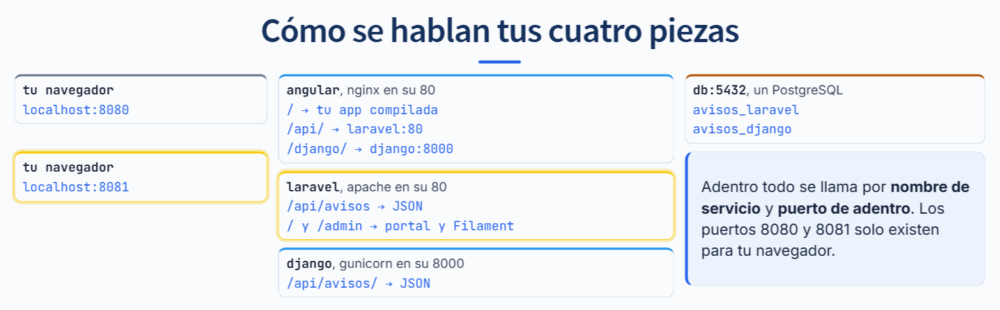

Tu proyecto son cuatro contenedores en una red. Una petición viaja así:

| Paso | De dónde | A dónde | Por qué nombre |
|---|---|---|---|
| 1 | Tu navegador | El nginx de `angular` | `localhost:8080` en tu máquina; tu dirección en el servidor |
| 2 | Tu Angular, en el navegador | El mismo nginx, en `/api/...` | La misma dirección de donde vino la página |
| 3 | El nginx de `angular` | `laravel`, puerto 80 | `laravel:80`, por la red |
| 4 | `laravel` | `db`, puerto 5432, base `avisos_laravel` | `DB_HOST=db` |
| 5 | El nginx de `angular`, en `/django/...` | `django`, puerto 8000 | `django:8000`, por la red |
| 6 | `django` | `db`, puerto 5432, base `avisos_django` | `DJANGO_DB_HOST=db` |

Y aparte, el **portal de Laravel**: sus vistas de Blade y su panel de Filament en `/admin`. Ese no pasa por Angular: lo abres directo en `localhost:8081`, y en el servidor tiene su propia dirección.

Como Angular pide todo al mismo sitio de donde vino, para el navegador es un solo sitio. Por eso no hay CORS que configurar: el que reparte es nginx, adentro.

**Comprueba cada flecha**, de la más cercana a la más lejana. Ábrelas en el navegador:

| Abre | Qué debes ver | Qué flecha comprueba |
|---|---|---|
| `http://localhost:8080` | Tu Angular | 1 |
| `http://localhost:8080/api/avisos` | JSON con tus avisos | 2, 3 y 4 |
| `http://localhost:8081/api/avisos` | El mismo JSON | 4, sin pasar por nginx |
| `http://localhost:8080/django/avisos/?format=json` | JSON con `"count"` | 5 y 6 |
| `http://localhost:8081` y `http://localhost:8081/admin` | Tu portal y tu Filament | El portal |

Si una falla y la de abajo funciona, el problema está entre las dos. Si `8081/api/avisos` funciona pero `8080/api/avisos` no, Laravel y su base están bien y el problema es el nginx de Angular. Si fallan las dos, mira `docker compose logs laravel`.


## 23. Qué es CI/CD


**Sin nada automático**, cada quien prueba en su máquina si se acuerda, los cambios se juntan al final y el día de subir al servidor se descubre lo que no funcionaba. Subir es un ritual a mano, y da miedo.

**CI, integración continua.** Juntas tus cambios a la rama principal seguido y en pedazos chicos, y en cada `git push` una máquina corre las pruebas sola. Si algo se rompe, lo sabes en minutos y sabes en qué commit fue.

**CD** tiene dos sabores:

- **Entrega continua:** lo que pasó las pruebas queda listo para salir, a un botón de distancia. Una persona decide cuándo.
- **Despliegue continuo:** sale solo, sin botón.

En el curso usamos **entrega continua**: el botón lo pulsas tú. Las pruebas dicen si *se puede*; el botón dice si *se quiere ahora*.

Las palabras que vienen con esto:

| Palabra | Qué es | En GitLab |
|---|---|---|
| **Pipeline** | La lista de pasos escrita en tu repositorio | `.gitlab-ci.yml` |
| **Etapa** | Un grupo de pasos que va en orden: la siguiente espera a que termine esta | `stages:` |
| **Trabajo** | Un paso: una imagen y unos comandos | Cada bloque con nombre, como `prueba_django` |
| **Runner** | La máquina que ejecuta los trabajos | `curso2-runner` |

Y la idea de fondo: la receta para probar y publicar vive en el repositorio, junto al código. Tiene historia, se revisa en un merge request y es igual para todos.

## 24. Git, GitHub y GitLab

Tres cosas distintas que se nombran juntas.

**Git** es el programa que llevas usando todo el curso. Vive en tu máquina y no necesita Internet. Hace `commit`, `branch`, `merge`.

**GitHub** es un sitio donde guardar repositorios de Git, con pantallas encima.

**GitLab** es otro sitio que hace lo mismo, con otros nombres.

| En GitHub | En GitLab | Es lo mismo |
|---|---|---|
| Pull Request | Merge Request, o MR | Pedir que tu rama entre a la principal |
| Actions | Pipelines, con `.gitlab-ci.yml` | Cosas que corren solas ante un cambio |
| Organización | Grupo | Varios repositorios juntos |

Tu `git push`, `git pull` y `git merge` no cambian ni una letra. Lo único que cambia es a dónde apunta el remoto.

## 25. Tu llave SSH


Para empujar a GitLab, GitLab tiene que saber que eres tú. La forma que no te vuelve a pedir nada es una **llave SSH**:

```
ssh-keygen -t ed25519 -C "tu-correo@ejemplo.com"
```

Ese comando crea **dos archivos a la vez**, que nacen juntos:

| Archivo | Qué es | Qué haces con él |
|---|---|---|
| `id_ed25519` | La llave **privada** | **Nada.** Nunca sale de tu máquina, no se sube al repositorio, no se pega en el canal |
| `id_ed25519.pub` | La llave **pública**, el candado | La pegas en tu perfil de GitLab. Se puede compartir sin miedo |

Viven en la carpeta `.ssh` de tu usuario: `~/.ssh/` en Linux, Mac y Codespaces, y `C:\Users\tu-usuario\.ssh\` en Windows.

Cuando haces `git push`, GitLab te pone un reto que solo la llave correcta puede resolver. Tu máquina lo resuelve y manda **la respuesta, no la llave**. Por eso no escribes contraseña, y por eso con el candado nadie puede entrar.

Para comprobar que quedó:

```
ssh -T git@gitlab.com
```

Te tiene que saludar por tu usuario: `Welcome to GitLab, @tu-usuario!`. Si pierdes la privada, o sospechas que alguien la vio, generas otro par y cambias el candado en GitLab.

## 26. Mover un repositorio sin perder la historia

Un remoto no es más que un nombre con una dirección. `origin` se llama así por costumbre, no por obligación, y puedes tener varios.

```
git remote -v
git remote add gitlab git@gitlab.com:tu-usuario/avisos.git
git push gitlab --all
git push gitlab --tags
```

`--all` empuja todas las ramas, `--tags` las etiquetas. Al terminar, la historia completa está en los dos lados. No se copió nada a mano: es la misma historia de Git en otro servidor.

Un detalle que cuesta una hora si se pasa por alto: **el proyecto nuevo tiene que nacer vacío**, sin README. Si nace con uno, su primer commit no tiene nada que ver con el tuyo, las dos historias no comparten nada y el push se rechaza con `Updates were rejected because the remote contains work that you do not have`.

## 27. El runner


Cuando llega un push, GitLab lee tu `.gitlab-ci.yml` y arma la lista de trabajos. **GitLab no ejecuta nada**: solo reparte.

Un **runner** es una máquina conectada preguntando si hay algo que hacer. Toma el trabajo y, para cada uno, levanta un contenedor limpio con la imagen que pediste en `image:`. Todo lo que aprendiste de Docker es lo que hace esto posible.

Si no hay ningún runner disponible, tu pipeline se queda en `pending`, GitLab le pone la etiqueta `stuck`, y no hay error de tu código que leer: simplemente no avanza. Es de los estados que más desconciertan porque parece un problema del código y no lo es.

Hay dos clases:

- **Compartidos**, los que pone quien hospeda GitLab. En el plan gratuito de gitlab.com piden una tarjeta de crédito y dan 400 minutos al mes.
- **Propios**, una máquina tuya con el programa del runner. Son ilimitados y gratis, y lo único que cuesta es la máquina donde corren. Es lo que usa el curso.

## 28. El archivo del pipeline

Un extracto, para ver la forma. El trabajo completo, con todas las variables de su base de prueba, está en la guía 03.

```yaml
stages:
  - probar
  - desplegar

prueba_django:
  stage: probar
  image: python:3.12-slim
  services:
    - name: postgres:16-alpine
      alias: db
  before_script:
    - pip install -r api-django/requirements.txt
  script:
    - cd api-django && python manage.py test
```

- Las **etapas** van en orden: todo lo de una termina antes de que empiece la siguiente.
- Los **trabajos** de una misma etapa corren **al mismo tiempo**.
- `image` es la imagen de Docker donde corre ese trabajo.
- `services` son contenedores de apoyo. El `alias` es el nombre por el que tu código los alcanza, igual que el nombre del servicio en Compose.
- `before_script` y `script` son comandos, tal cual. Si un comando devuelve error, el trabajo se pone rojo ahí mismo.

Si un trabajo se pone rojo, la etapa siguiente no arranca. Eso es lo que compras con este archivo: que un cambio que rompe las pruebas no tenga manera de llegar al servidor.

## 29. Los estados, y cómo leerlos


| Estado | Qué significa | Qué hacer |
|---|---|---|
| `pending` | Nadie ha tomado el trabajo | Mira si hay runner. **No es tu código** y en los logs no hay nada. Si además dice `stuck`, GitLab ya te está diciendo que no hay runner. |
| `running` | Está corriendo | Puedes ver la salida en vivo. |
| `passed` | Todos los comandos devolvieron cero | |
| `failed` | Un comando devolvió error | Abre el log: dice en qué comando fue. |
| `skipped` | No corrió porque algo anterior falló | Arregla lo anterior. |
| `manual` | Espera a que alguien lo pulse | Es una puerta, no un error. |
| `blocked` | El pipeline entero espera un trabajo manual, como el botón de desplegar | Púlsalo cuando quieras desplegar. |
| `canceled` | Alguien lo detuvo | |

## 30. Lo que no cabe en clase

Esta sección es la que más se usa después, cuando llegas a un proyecto de verdad.

### `rules`: cuándo existe un trabajo

```yaml
  rules:
    - if: '$CI_COMMIT_BRANCH == $CI_DEFAULT_BRANCH'
      when: manual
    - if: '$CI_PIPELINE_SOURCE == "merge_request_event"'
      when: always
    - when: never
```

Se evalúan en orden y **gana la primera que coincide**. La última línea suelta, `when: never`, es la que evita que el trabajo aparezca en cualquier otro caso.

Variables que vale la pena conocer: `CI_COMMIT_BRANCH` (la rama), `CI_DEFAULT_BRANCH` (la principal del proyecto), `CI_PIPELINE_SOURCE` (qué disparó el pipeline), `CI_COMMIT_SHORT_SHA` (el identificador corto del commit, muy útil para etiquetar imágenes).

También se puede filtrar por archivos, que ahorra mucho tiempo en proyectos grandes:

```yaml
  rules:
    - changes:
        - frontend/**/*
```

### `needs`: romper el orden de las etapas

Por defecto, un trabajo espera a que termine toda la etapa anterior. Con `needs` esperas solo a lo que de verdad necesitas, y el pipeline acaba antes:

```yaml
  needs: [prueba_laravel, prueba_django, construye_angular]
```

### `artifacts`: llevarse archivos de un trabajo a otro

Cada trabajo empieza con un contenedor limpio, así que lo que produce se pierde. `artifacts` guarda archivos para descargarlos o para pasarlos al siguiente trabajo:

```yaml
  artifacts:
    paths:
      - frontend/dist/
    expire_in: 1 week
```

También se usa para reportes: `artifacts: reports: junit:` hace que GitLab te muestre las pruebas que fallaron en la propia pantalla de la MR, sin abrir el log.

### `cache`: no volver a descargar lo mismo

Distinto de `artifacts`. El caché es para acelerar, y si se pierde no pasa nada:

```yaml
  cache:
    key:
      files:
        - frontend/package-lock.json
    paths:
      - frontend/node_modules/
```

Con la clave atada al lock, el caché se reusa mientras las dependencias no cambien. Es la misma idea que las capas de Docker.

### `environment`: saber qué versión hay dónde

```yaml
  environment:
    name: produccion
    url: https://tuyo.ejemplo
```

GitLab lleva un registro de qué commit está desplegado en cada entorno y cuándo. Es la pantalla que se mira cuando alguien pregunta "¿ya subió mi cambio?".

### `resource_group`: un despliegue a la vez

```yaml
  resource_group: produccion
```

Sin esto, dos despliegues al mismo destino pueden correr encimados y dejar una mezcla de las dos versiones.

### El registro de imágenes

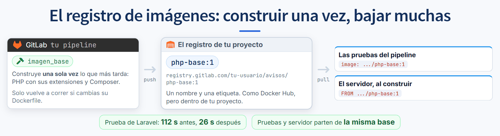

Un registro es una tienda de imágenes, como Docker Hub. GitLab le da uno a cada proyecto: está en **Deploy**, **Container registry**, y ya lo tienes aunque nunca lo hayas abierto. Subir una imagen se dice **push**; bajarla, **pull**. Cada imagen tiene un nombre, que dice de qué proyecto es, y una etiqueta, que dice qué versión: `registry.gitlab.com/tu-usuario/avisos/php-base:1`.

Se usa de dos maneras:

- **Para lo que tarda y casi no cambia.** El pipeline construye una base con PHP, sus extensiones y Composer, la sube una vez, y desde ahí las pruebas y el servidor la bajan en lugar de compilar. Es la guía 05: en el ensayo del curso, la prueba de Laravel bajó de 112 a 26 segundos.
- **Para la imagen completa de cada versión.** Es lo que hace un sistema grande: el pipeline construye la imagen entera en cada commit, la sube etiquetada con el identificador del commit, y el servidor ya no construye, solo descarga esa etiqueta. Lo que se probó y lo que se despliega son **la misma imagen**, no dos construcciones que podrían diferir, y volver a una versión exacta es pedir otra etiqueta.

Casi todos los ejemplos que vas a encontrar construyen con `docker build` dentro del pipeline. En el runner del curso eso no funciona, y es a propósito: los trabajos no tienen acceso al Docker del servidor, porque dárselo le daría a cualquier trabajo el control de la máquina entera. Por eso la guía 05 construye con **Kaniko**, que hace imágenes a partir de un Dockerfile sin necesitar Docker.

En la clase no usamos registro porque el servidor construye directo desde tu repositorio, y eso quita varias piezas del camino. Pero es lo que vas a encontrar en un proyecto grande.

## 31. Los secretos del pipeline

Nunca en el archivo. En **Settings**, **CI/CD**, **Variables** del proyecto.

- **Masked:** si el valor aparece en un log, GitLab lo tapa. Sin esto, un `echo` distraído lo publica.
- **Protected:** solo se entrega a ramas protegidas. Así una rama cualquiera no puede leer la clave de producción.
- **Tipo File:** para llaves y certificados. GitLab los deja como archivo y te pasa la ruta.

Lo que sí va escrito en el `.gitlab-ci.yml` son las contraseñas de las bases de prueba, porque son de mentira y viven solo mientras dura el trabajo.

Y una regla que no tiene vuelta: **una clave que se subió a Git ya se filtró**, aunque borres el commit. Sigue en la historia y en los clones de los demás. Lo único que sirve es rotarla.

## 32. Del commit a una dirección

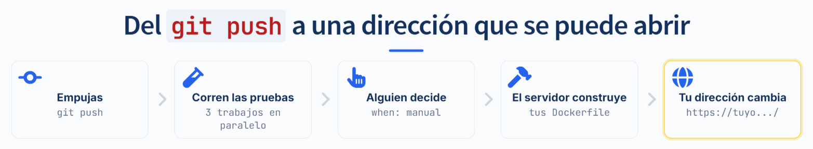

1. Empujas a la rama principal.
2. Arrancan los trabajos de prueba, en paralelo. Si uno se pone rojo, la cadena se corta aquí.
3. Con todos en verde aparece el botón. **Una persona** decide cuándo.
4. El trabajo de despliegue le avisa al servidor con una petición autenticada. El servidor clona el repositorio, construye las imágenes con tus Dockerfile y levanta tu `compose.yaml`.
5. El trabajo pregunta cada pocos segundos cómo va, y al final abre la dirección. Solo queda en verde si responde: que el servidor diga "terminé" no es lo mismo que que el sitio funcione.
6. La dirección sirve la versión nueva.

De principio a fin, lo único que hiciste fue empujar y pulsar un botón. Eso es CI/CD: la parte de **integración continua** son las pruebas que corren solas en cada cambio, y la de **entrega continua** es que llegar a producción sea un botón y no un procedimiento.

## 33. Cómo llega una visita a tu proyecto

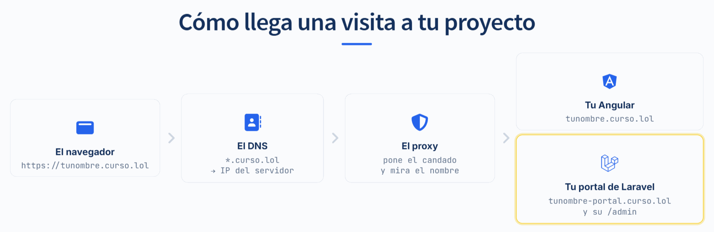

Cuando alguien abre `https://tunombre.curso.lol`, pasan cuatro cosas:

1. **El DNS.** Antes de conectarse, la computadora pregunta qué IP tiene ese nombre, como buscar un teléfono en una agenda. Todos los nombres `*.curso.lol` apuntan a la misma IP: el servidor del curso.
2. **El proxy.** En el servidor contesta un programa que mira con qué nombre llegó la visita y la manda al contenedor que corresponde, por la red de Docker. Es lo mismo que hace el nginx de tu Angular con `/api/`, pero por nombre en vez de por ruta.
3. **El candado.** El proxy tiene un certificado de HTTPS por cada nombre, y descifra ahí. Hacia adentro la petición sigue sin cifrar, con un aviso: `X-Forwarded-Proto: https`. Por eso tu Dockerfile de Laravel lleva la línea `detras-de-proxy`: sin ella, Laravel cree que la visita llegó sin cifrar, arma sus direcciones con `http://` y el navegador las bloquea en una página segura.
4. **Tu contenedor.** Tu proyecto tiene dos nombres:

| Dirección | A dónde llega | Qué ves |
|---|---|---|
| `https://tunombre.curso.lol` | Tu `angular` | Tu frontend, que habla con tus dos APIs por `/api/` y `/django/` |
| `https://tunombre-portal.curso.lol` | Tu `laravel`, directo | Tu portal de Blade, y tu panel de Filament en `/admin` |

## 34. Una máquina compartida

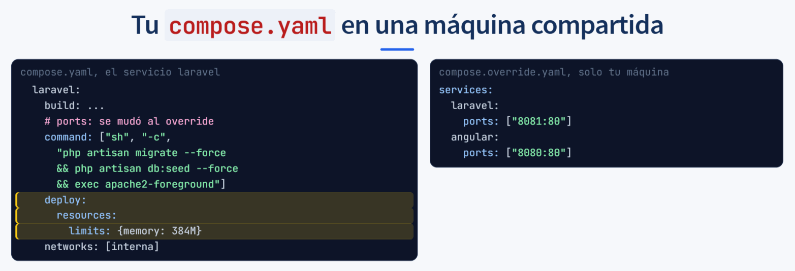

En el servidor del curso viven los proyectos de todo el grupo, cada uno con su red, sus volúmenes y su dirección. No se ven entre ellos: un contenedor de un proyecto no alcanza la base de otro ni por su nombre ni por su dirección IP. Pero la máquina es una, y eso cambia tres cosas del `compose.yaml`.

**Nadie publica puertos.** Si doce proyectos publican el 8080, el segundo que despliega falla con `port is already allocated`. Las peticiones de afuera las recibe un **proxy**, que mira el nombre con el que llegaron (`ana.curso.lol`, `luis.curso.lol`) y las manda al contenedor que corresponde, por la red, sin puerto publicado. Es el mismo proxy el que saca el certificado de HTTPS de cada nombre.

Para seguir abriendo `localhost:8080` en tu máquina, Compose tiene un mecanismo hecho para esto: si junto a `compose.yaml` hay un `compose.override.yaml`, `docker compose up` lee los dos y los mezcla. El servidor lee solo el primero. Así, lo que corre en todas partes vive en `compose.yaml`, y lo que solo tiene sentido en tu máquina, como los puertos, vive en el override. Se comprueba con `docker compose -f compose.yaml config`, que muestra lo que vería alguien que solo lee ese archivo.

**Las migraciones y los seeders corren al arrancar.** En el servidor no hay terminal donde escribir `php artisan migrate` ni `php artisan db:seed`. Por eso van en el `command` del servicio, antes de arrancar el servidor web y unidos con `&&`: si algo falla, el servidor web no arranca y el despliegue se nota roto en vez de quedar a medias. Esa línea corre en **cada** despliegue, así que solo lleva comandos que avanzan y seeders que se pueden repetir sin duplicar, con `firstOrCreate`. Nada que borre.

**Cada servicio declara su tope de memoria**, con `deploy.resources.limits.memory`. En una máquina compartida, un contenedor que se come la memoria tumba a todos; con tope, Docker detiene solo al que se pasó. `docker stats` muestra el uso contra el tope, por ejemplo `64.83MiB / 384MiB`.

Nada de esto es exclusivo del curso. Es lo mismo que cambia cuando un proyecto pasa de la computadora de alguien a cualquier servidor que compartan varios sistemas.

## 35. Volver atrás

| Se puede volver | No se puede volver |
|---|---|
| El código: despliegas el commit anterior | Una migración que borró una columna |
| Los archivos de la imagen: la vieja sigue existiendo | Un `down -v` en el servidor |
| | Un correo que ya salió |

Por eso la puerta es manual. Un despliegue no es solo copiar archivos: puede cambiar la base de datos, y esa parte no tiene botón de deshacer.

Dos ideas que conviene tener claras:

**Volver atrás no es arreglar.** Es comprarte tiempo para arreglar con calma. Si vuelves y no escribes por qué falló, mañana lo despliegas otra vez igual.

**Un respaldo que nunca se ha restaurado no es un respaldo, es un archivo.** La única manera de saber que sirve es haberlo usado una vez.

## 36. Lo que este pipeline no hace

Lo de la clase es la base real, no un juguete. Pero saber lo que falta es parte de saber usarlo.

| Lo que sí queda cubierto | Lo que además necesita un sistema de verdad |
|---|---|
| Las pruebas corren en cada cambio | Revisiones de seguridad de las dependencias |
| Nadie despliega con las pruebas en rojo | Que **otra persona** apruebe la MR, no solo el autor |
| El despliegue lo dispara una persona | Permisos: quién puede pulsar ese botón es una decisión |
| Las imágenes se construyen solas | Guardarlas versionadas, para poder volver a una exacta |
| Los datos viven en volúmenes | Respaldos automáticos **y una restauración ya ensayada** |
| El servicio responde | Que alguien se entere cuando deja de responder |

---

## Glosario

**Bind mount.** Una carpeta de tu máquina montada dentro de un contenedor. Se reconoce porque antes de los dos puntos hay una ruta.

**Build context.** La carpeta que Docker puede leer al construir. Es el punto del final de `docker build .`. Un `COPY` de algo fuera de ahí no encuentra nada.

**Capa.** Lo que deja cada instrucción del Dockerfile. Se guarda por separado y se reusa si no cambió.

**CI/CD.** Integración continua (las pruebas corren solas ante cada cambio) y entrega continua (llegar a producción es un botón). Si llega sola, sin botón, se llama despliegue continuo.

**Compose.** La herramienta que levanta varios contenedores juntos, con sus redes y sus volúmenes, a partir de un solo archivo: `compose.yaml`.

**compose.override.yaml.** Un segundo archivo de Compose que `docker compose up` mezcla solo con `compose.yaml`. Se usa para lo que solo tiene sentido en tu máquina, como publicar puertos.

**Contenedor.** Una imagen en ejecución. `docker run` crea uno nuevo cada vez.

**Demonio.** El programa de Docker que de verdad descarga, construye y arranca. Lo enciende Docker Desktop.

**Dirección IP.** El número con el que una máquina, o un contenedor, se encuentra en una red. Dentro de Docker cambia cada vez que se recrea un contenedor; por eso se usa el nombre.

**DNS.** El directorio que traduce un nombre a una dirección IP. Lo hay en Internet, para `tunombre.curso.lol`, y lo hay dentro de cada red de Docker, para `db` o `laravel`.

**Dockerfile.** El archivo con los pasos para construir una imagen: de qué imagen partes, qué copias y qué instalas.

**Etapa, o stage.** Un grupo de trabajos del pipeline. Todo lo de una etapa termina antes de que empiece la siguiente.

**Etiqueta, o tag.** La parte de después de los dos puntos en el nombre de una imagen: el `1` de `php-base:1`. Dice qué versión es. Si no pones ninguna, Docker entiende `latest`.

**Healthcheck.** Un comando que se corre cada pocos segundos para saber si el servicio ya sirve, no solo si arrancó.

**Imagen.** Un paquete de solo lectura con el sistema, las herramientas y tu código. No corre.

**Kaniko.** Un programa que construye imágenes a partir de un Dockerfile sin necesitar Docker. Es el que usa la guía 05 dentro del pipeline.

**Llave SSH.** Un par de archivos: la privada, que nunca sale de tu máquina, y la pública, que se pega en GitLab. Sirve para que GitLab sepa que eres tú sin pedirte contraseña.

**localhost.** La máquina desde donde se pregunta. En tu navegador es tu computadora; dentro de un contenedor, es ese contenedor.

**Merge Request, o MR.** Lo que en GitHub se llama Pull Request.

**Multietapa.** Un Dockerfile con varios `FROM`. Solo la última etapa queda como imagen final.

**Pipeline.** El conjunto de trabajos que corren ante un cambio.

**Portal de Laravel.** Tus vistas de Blade y tu panel de Filament en `/admin`. No pasa por Angular: en tu máquina se abre en `localhost:8081` y en el servidor en `tunombre-portal.curso.lol`.

**Proxy.** El programa que recibe las peticiones de afuera y las reparte según el nombre con el que llegaron. En el servidor del curso también saca el certificado de HTTPS de cada nombre.

**Puerto.** Una de las puertas numeradas de una máquina. Un programa que espera visitas escucha detrás de una. En `-p 8080:80`, la izquierda es tu computadora y la derecha, el contenedor.

**Pull y push.** Bajar una imagen de un registro y subirla a uno.

**Red.** El cable virtual que une a varios contenedores y les da un directorio de nombres. Lo que está en la misma red se ve por su nombre; lo que no, no existe.

**Registro.** La tienda de imágenes. Docker Hub es el que viene por defecto, y GitLab le da uno a cada proyecto.

**Rollback.** Volver a una versión anterior. Sirve para el código, no para los datos.

**Runner.** La máquina que ejecuta los trabajos del pipeline. Sin ninguno, todo se queda en `pending`.

**Seeder.** Una clase de Laravel que llena la base con datos de arranque. En el servidor corre en cada despliegue, así que tiene que poder repetirse sin duplicar: `firstOrCreate`.

**Trabajo, o job.** Una unidad del pipeline: una imagen y unos comandos.

**Volumen.** Una caja de datos que vive fuera del contenedor. Sobrevive a `down` y muere con `down -v`.

**YAML.** El formato de `compose.yaml` y de `.gitlab-ci.yml`: claves con dos puntos, listas con guion, y la sangría, con espacios, dice qué pertenece a qué.


---

## Para seguir leyendo

- [Docker: guía de inicio](https://docs.docker.com/get-started/)
- [Referencia del Dockerfile](https://docs.docker.com/reference/dockerfile/)
- [Compose: referencia del archivo](https://docs.docker.com/reference/compose-file/)
- [Buenas prácticas para escribir Dockerfiles](https://docs.docker.com/build/building/best-practices/)
- [GitLab: tu primer pipeline](https://docs.gitlab.com/ci/quick_start/)
- [GitLab: referencia del YAML](https://docs.gitlab.com/ci/yaml/)
- [GitLab: variables y secretos](https://docs.gitlab.com/ci/variables/)
- [GitLab: entornos y despliegues](https://docs.gitlab.com/ci/environments/)
