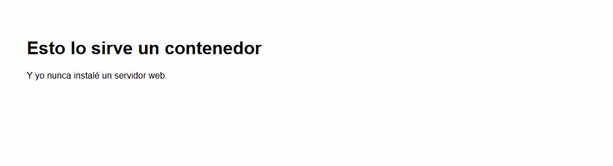
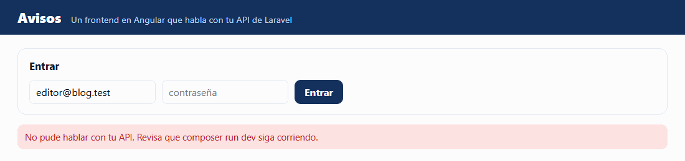

# Guía 01: tu primera imagen

Vas a escribir dos `Dockerfile`. El primero tiene tres líneas y sirve una página. El segundo empaqueta tu aplicación de Angular y pesa doce veces menos de lo que pesaría si lo hicieras de la manera obvia.

Lo que no termines en clase se acaba en la tarea.

---

## Antes de empezar: tres ideas

Si alguna de estas no te queda clara, la lectura `00-docker-y-gitlab-por-dentro.md` la cuenta con calma.

**1. Imagen y contenedor no son lo mismo.** La imagen es el molde: no corre y no cambia. El contenedor es lo que sale del molde cuando lo corres. Un `Dockerfile` es la receta para hacer tu propio molde, y `docker build` lo hace.


**2. Un contenedor no tiene puertas hacia afuera** hasta que tú le abres una con `-p`. La izquierda es tu computadora; la derecha, el contenedor.


**3. Cada instrucción del Dockerfile deja una capa**, y Docker reusa las que no cambiaron. Por eso el orden de las líneas decide cuánto tarda cada build.


### La terminal, en el lugar correcto

La terminal va **en tu computadora**, no dentro del Dev Container. En Windows, PowerShell; en Mac, Terminal. Ve a la carpeta de tu proyecto.

Comprueba que Docker responde:

```
docker version
```

Tiene que salir un bloque `Client` y otro `Server`. Si solo sale `Client`, abre Docker Desktop y espera a que arranque.

---

## Reto 1: el Dockerfile más corto que hace algo

### 1. Una carpeta con algo que servir

En la raíz de tu proyecto:

```
mkdir prueba-docker
```

Dentro crea un archivo `index.html` con lo que quieras. Por ejemplo:

```html
<!DOCTYPE html>
<html lang="es">
<head><meta charset="utf-8"><title>Mi primera imagen</title></head>
<body style="font-family: sans-serif; padding: 40px;">
    <h1>Esto lo sirve un contenedor</h1>
    <p>Y yo nunca instalé un servidor web.</p>
</body>
</html>
```

### 2. El Dockerfile

Crea `prueba-docker/Dockerfile`, **sin extensión**, con estas tres líneas:

```dockerfile
FROM nginx:1.27-alpine
COPY . /usr/share/nginx/html/
EXPOSE 80
```

Qué hace cada una:

| Línea | Qué hace |
|---|---|
| `FROM nginx:1.27-alpine` | Parte de una imagen que ya existe: un Linux chico con nginx instalado. Nunca se empieza de cero |
| `COPY . /usr/share/nginx/html/` | Copia lo que hay en tu carpeta a la carpeta de donde nginx sirve páginas, adentro de la imagen |
| `EXPOSE 80` | Una nota para quien lea el archivo: "este programa escucha en el 80". No abre nada. Si la quitas, todo sigue funcionando |

> En Windows, si el Explorador le agrega `.txt` al nombre, Docker no lo encuentra. En VS Code, al guardar, escribe el nombre `Dockerfile` tal cual.

### 3. Constrúyelo

```
cd prueba-docker
docker build -t mi-sitio .
```

El comando, pieza por pieza:

| Pieza | Qué es |
|---|---|
| `docker build` | Construye una imagen a partir de un `Dockerfile` |
| `-t mi-sitio` | Le pone nombre a la imagen, para usarla después. `t` de *tag* |
| `.` | La carpeta que Docker puede leer mientras construye: la actual. No es decoración |

Lo que imprime tiene esta forma. Fíjate en las líneas con `[1/2]` y `[2/2]`:

```
[+] Building 1.5s (7/7) FINISHED
 => [internal] load build definition from Dockerfile
 => [internal] load metadata for docker.io/library/nginx:1.27-alpine
 => [1/2] FROM docker.io/library/nginx:1.27-alpine@sha256:65645c7b...
 => [internal] load build context
 => [2/2] COPY . /usr/share/nginx/html/
 => exporting to image
 => => naming to docker.io/library/mi-sitio:latest
```

Hay **dos** pasos numerados, no tres: cada uno es una instrucción que cambia archivos y deja una capa. `EXPOSE` no cambia archivos, así que no cuenta. Las líneas `[internal]` son de Docker preparándose.

La primera vez, el `FROM` descarga nginx y tarda. La segunda, dice `CACHED` y es instantáneo.

### 4. Córrelo

```
docker run --rm -p 8080:80 mi-sitio
```

| Pieza | Qué es |
|---|---|
| `docker run` | Crea un contenedor a partir de una imagen y lo arranca |
| `--rm` | Bórralo cuando lo apagues, para no dejar basura |
| `-p 8080:80` | Tu puerto 8080 lleva al 80 de adentro, donde escucha nginx |
| `mi-sitio` | La imagen que acabas de construir. Siempre va al final |

Abre `http://localhost:8080` en tu navegador. Tiene que verse así:



La terminal se queda ocupada mientras el contenedor corre: ahí aparece cada visita que recibe nginx. Para apagarlo, `Ctrl` y `C`.

### Compruébalo

- `docker images mi-sitio` muestra tu imagen. En las versiones recientes salen dos tamaños: `DISK USAGE`, lo que ocupa en tu disco, y `CONTENT SIZE`, lo que pesa comprimida. En la máquina del curso, **73.6 MB** en disco.
- La página abre en el navegador.
- **Piensa esto antes de seguir:** ¿en qué momento instalaste nginx? En ninguno. Venía dentro de la imagen del `FROM`.

### Si falla

| Lo que ves | Qué pasa |
|---|---|
| `failed to read dockerfile: open Dockerfile: no such file or directory` | No estás en `prueba-docker`, o el archivo se llama `Dockerfile.txt`. `dir` en Windows o `ls` en Mac te dice cómo se llama de verdad. |
| `failed to compute cache key: "/." not found` | Estás construyendo desde otra carpeta. El punto final del comando es la carpeta que se copia. |
| `Bind for 0.0.0.0:8080 failed: port is already allocated` | Otra cosa ocupa tu 8080. Cambia el número de la izquierda: `-p 8090:80`, y abre `localhost:8090`. |
| La página sale, pero es la de bienvenida de nginx | El `COPY` no encontró tu `index.html`. Comprueba que el archivo está en `prueba-docker` y que construiste desde ahí. |
| `exec: line 47: illegal option -p` | Pusiste el `-p` después del nombre de la imagen. Todas las opciones van antes. |

---

## Reto 2: la imagen de tu Angular

Esta es la de verdad. Va en la raíz del proyecto, no en `prueba-docker`.

### 1. Primero, la versión obvia (para poder comparar)

Crea `docker/angular-una-etapa.Dockerfile`:

```dockerfile
FROM node:20-alpine
WORKDIR /app
COPY frontend/package.json frontend/package-lock.json ./
RUN npm ci
COPY frontend/ ./
RUN npm run build -- --configuration production
EXPOSE 4200
CMD ["npx", "http-server", "dist/avisos", "-p", "4200"]
```

Las instrucciones nuevas:

| Instrucción | Qué hace |
|---|---|
| `WORKDIR /app` | Se para en esa carpeta de adentro, y la crea si no existe. Lo que sigue pasa ahí |
| `RUN npm ci` | Corre un comando **mientras se construye** la imagen. Lo que deja, como `node_modules`, queda guardado en una capa |
| `CMD [...]` | El comando que corre **cuando arranca** el contenedor. No corre al construir |

Fíjate en el orden: primero se copian **solo** `package.json` y `package-lock.json`, se instalan las dependencias, y hasta después se copia el resto del código. En el reto 3 vas a medir por qué.

Desde la raíz del proyecto:

```
docker build -f docker/angular-una-etapa.Dockerfile -t avisos-angular:una .
```

El `-f` le dice cuál Dockerfile usar, porque este no se llama `Dockerfile` ni está en la carpeta actual. Y `avisos-angular:una` es nombre y etiqueta: después de los dos puntos va la versión, y aquí la usamos para distinguir las dos imágenes.

Tarda. Cuando acabe, mira el tamaño:

```
docker images avisos-angular
```

Anótalo. En la máquina del curso dio **872 MB**. Adentro va Node completo y todas las dependencias de desarrollo, aunque para servir unos archivos no hacen falta.

### 2. Ahora la de dos etapas


Crea `docker/angular.Dockerfile`:

```dockerfile
# Etapa 1: construir. Node compila el proyecto y deja HTML, CSS y JS en dist/
FROM node:20-alpine AS construir
WORKDIR /app
COPY frontend/package.json frontend/package-lock.json ./
RUN npm ci
COPY frontend/ ./
RUN npm run build -- --configuration production

# Etapa 2: servir. Solo viaja dist/. Ni Node ni node_modules llegan aqui.
FROM nginx:1.27-alpine
COPY --from=construir /app/dist/avisos/ /usr/share/nginx/html/
COPY docker/angular.nginx.conf /etc/nginx/conf.d/default.conf
EXPOSE 80
```

Lo nuevo:

| Pieza | Qué hace |
|---|---|
| `AS construir` | Le pone nombre a la primera etapa |
| Un segundo `FROM` | Empieza otra imagen, desde cero. Solo la última etapa queda como tu imagen final |
| `COPY --from=construir` | Copia desde la primera etapa, no desde tu carpeta. Así viaja solo lo compilado |

El archivo `docker/angular.nginx.conf` ya viene con la base: es la configuración de nginx que además manda `/api/` a Laravel y `/django/` a Django. Esa parte la vas a usar en la guía 02.

```
docker build -f docker/angular.Dockerfile -t avisos-angular:multi .
docker images avisos-angular
```

En la máquina del curso: **73.8 MB**. La aplicación compilada pesa 184 kB; el resto es nginx.

### 3. Compruébalo funcionando

```
docker run --rm -p 8080:80 avisos-angular:multi
```

Abre `http://localhost:8080`. Tu Angular abre, pero **no puede hablar con la API**, y **está bien**: todavía no hay ninguna API corriendo. Se ve más o menos así:



En la terminal vas a ver errores de nginx que terminan en `while resolving`: nginx quiere preguntar dónde está `laravel`, y corriendo solo con `docker run`, fuera de una red de Compose, no tiene a quién preguntarle. Eso se arregla en la guía 02, cuando levantes todo junto.

### Compruébalo

- Las dos imágenes existen y una pesa más de diez veces lo que la otra.
- Las dos sirven la misma aplicación.
- Sabes decir, sin mirar el archivo, qué hay dentro de la grande que no hay dentro de la chica.

### Si falla

| Lo que ves | Qué pasa |
|---|---|
| `npm ci ... can only install with an existing package-lock.json` | Falta el lock, o no lo copiaste. Si tu `frontend/` no tiene `package-lock.json`, genera uno con `npm install` dentro de `frontend/` y súbelo al repositorio. |
| `COPY --from=construir /app/dist/avisos/: not found` | Tu proyecto de Angular no se llama `avisos`. Mira `outputPath` en `angular.json` y usa esa ruta. |
| El build se queda mucho rato en `npm ci` | Es normal la primera vez: son varios cientos de dependencias. La segunda vez esa capa se reusa. |
| `Cannot find module '@angular/...'` | El `COPY frontend/ ./` no trajo todo. Revisa que no tengas `frontend` en el `.dockerignore`. |
| `host not found in upstream "laravel"` y el contenedor se apaga solo | Tu `docker/angular.nginx.conf` es una versión vieja, sin la línea `resolver`. Usa la que trae la base. |

---

## Reto 3: rompe la caché a propósito

Esto es para que veas con tu reloj por qué el orden de las líneas importa.


### 1. Mide el build sin cambios

Vuelve a construir sin tocar nada:

```
docker build -f docker/angular.Dockerfile -t avisos-angular:multi .
```

En la máquina del curso: **2 segundos**. Todas las capas dicen `CACHED`.

### 2. Cambia una línea de código

Agrega un comentario al final de `frontend/src/styles.css` y construye otra vez.

En la máquina del curso: **11 segundos**. El `npm ci` se reusó; solo se rehizo la compilación.

### 3. Ahora cambia `package.json`

Cámbiale cualquier cosa, por ejemplo agrega una línea `"description": "prueba"`. Construye otra vez.

En la máquina del curso: **35 segundos**. Se cayó la capa de las dependencias y todo lo que estaba encima.

### 4. Y ahora hazlo mal a propósito

Haz una copia, `docker/angular-mal.Dockerfile`, con el `COPY` del código **antes** del `npm ci`:

```dockerfile
FROM node:20-alpine AS construir
WORKDIR /app
COPY frontend/ ./
RUN npm ci
RUN npm run build -- --configuration production
```

Constrúyelo dos veces seguidas con `docker build -f docker/angular-mal.Dockerfile -t avisos-angular:mal .`, cambiando un comentario del código entre una y otra. Fíjate en que ahora **siempre** tarda lo que tardaba el caso lento: cualquier cambio de código tumba la capa del `COPY`, y con ella el `npm ci` de abajo.

Cuando lo hayas visto, borra `docker/angular-mal.Dockerfile` y quita el cambio de `package.json`. Deja tu `docker/angular.Dockerfile` bien.

### Compruébalo

Tienes tres tiempos anotados y puedes explicar por qué son distintos. Esa explicación es lo que se evalúa, no los segundos exactos: tu máquina va a dar otros números.

---

## Limpia al terminar

Las imágenes de prueba ocupan disco. Cuando termines:

```
docker rmi mi-sitio avisos-angular:una avisos-angular:mal
```

Y borra los archivos de práctica, para que no lleguen a tu repositorio cuando hagas `git add -A`: la carpeta `prueba-docker/` y `docker/angular-una-etapa.Dockerfile`.

`avisos-angular:multi` déjala: te sirve para comparar en la guía 02.

---

## Lo que queda para la tarea

Si en clase llegaste hasta aquí, vas bien. Lo que sigue está en la guía 02: los otros dos `Dockerfile` y el archivo que levanta todo junto.

Si te atoras en uno, pregunta en el canal con la captura del error completo: se te enseña el bloque que te falta, no el archivo entero. Lo que se pide en la entrega es que puedas explicar qué hace cada línea y por qué está en ese orden.
