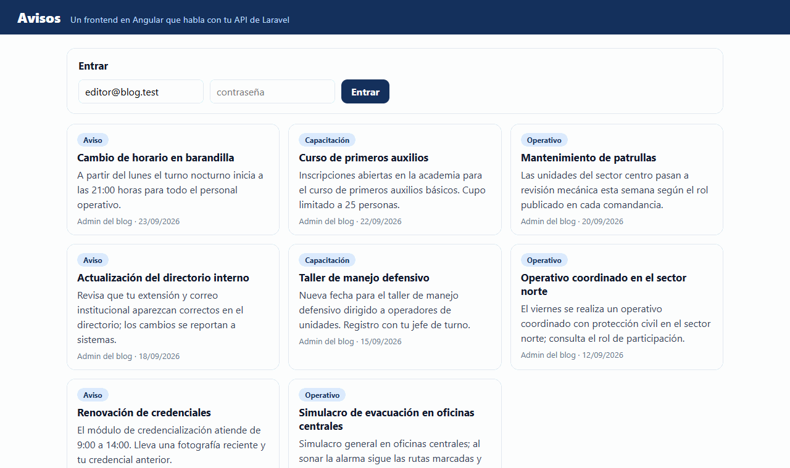
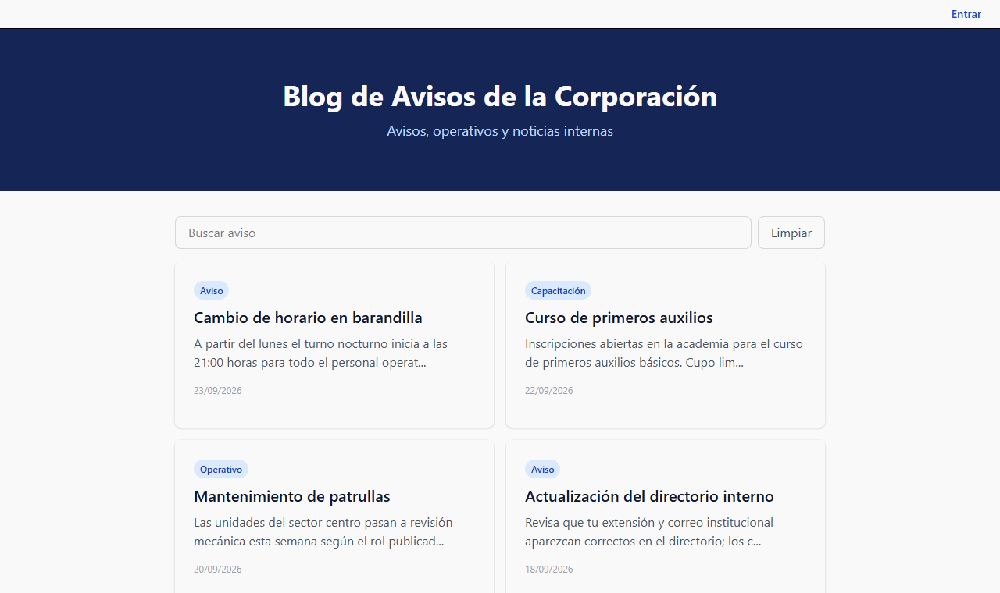
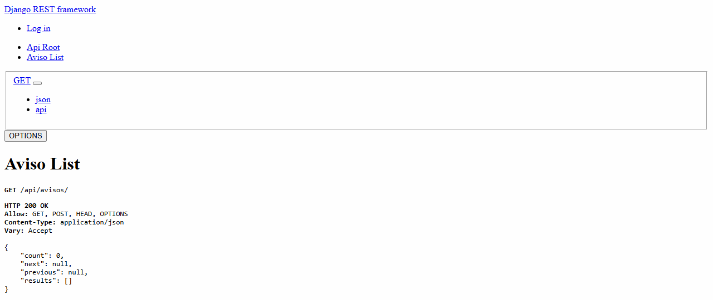
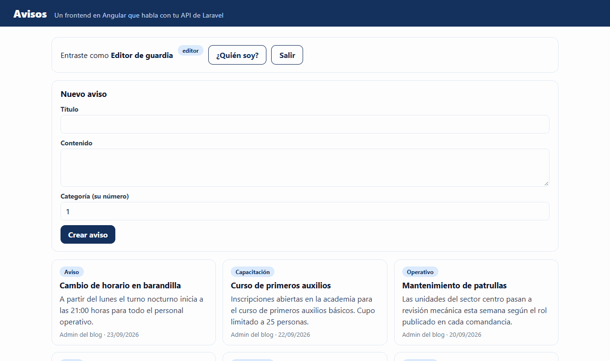
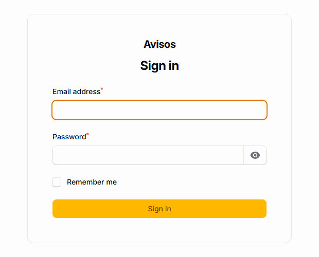

# Guía 02: todo junto, con su red y sus datos

Vas a terminar el `compose.yaml` hasta que levante cuatro servicios con un solo comando: tu Angular, tu API de Laravel, tu API de Django y una base de datos. Después lo vas a romper dos veces a propósito, porque las dos maneras de romperlo son las que te vas a encontrar de verdad.

---

## Antes de empezar: lo que tienes que tener claro

**Compose** es un archivo, `compose.yaml`, que describe varios contenedores y cómo se conectan. `docker compose up` los levanta todos, y `docker compose down` los apaga todos.

El archivo está en **YAML**: claves con dos puntos, listas con guion, y la sangría, con espacios y nunca con tabulador, dice qué pertenece a qué. Casi todos los errores de este laboratorio son un espacio de más o de menos.


Los cuatro servicios viven en una **red**. Adentro se llaman por su nombre: Laravel encuentra a la base como `db`, no como `localhost`.


Y los datos de la base viven en un **volumen**, fuera del contenedor, para que sobrevivan cuando el contenedor se borra.


La lectura 00 cuenta cada idea con más calma, en sus secciones de YAML, Compose, redes y volúmenes.

### Lo que ya tienes

De la guía 01 ya tienes `docker/angular.Dockerfile`. Aquí escribes los otros dos.

Comprueba que el esqueleto llegó con la base:

```
docker compose config
```

Va a quejarse de que faltan variables. Eso es lo primero que arreglas.

---

## Reto 1: completa el archivo

### 1. Tus variables

Compose lee un archivo `.env` al lado del `compose.yaml`, solo, sin que le digas nada. Y ese archivo **ya existe**: es el mismo `.env` de Laravel que llevas usando desde la sesión 2.

No hace falta uno nuevo. Abre `docker/variables.env.example`, copia su contenido y **pégalo al final de tu `.env`**.

Después cambia los dos valores que dicen `CAMBIAME`:

- `BD_CLAVE`: cualquier cosa larga.
- `DJANGO_SECRET_KEY`: otra distinta. Puedes generarla con `python -c "import secrets; print(secrets.token_urlsafe(50))"`.

Fíjate en que **no hay que poner `APP_KEY`**: ya está en tu `.env` desde la sesión 2, y Compose la reusa tal cual. Ese es el punto de compartir el archivo.

> Tu `.env` no se sube a Git ni entra a las imágenes: ya está en `.gitignore` y en `.dockerignore`. El que sí se sube es `docker/variables.env.example`, que solo dice **qué nombres** hacen falta, con valores de mentira.

### 2. El Dockerfile de Laravel

Crea `docker/laravel.Dockerfile`:

```dockerfile
# Etapa 1: los assets de Vite (lo que aprendiste en la sesion 1)
FROM node:20-alpine AS assets
WORKDIR /app
COPY package.json ./
RUN npm install
COPY vite.config.js ./
COPY resources/ resources/
RUN npm run build

# Etapa 2: PHP con Apache. Una sola imagen que ya sabe servir Laravel.
FROM php:8.3-apache
RUN apt-get update && apt-get install -y --no-install-recommends \
        libpq-dev libzip-dev libicu-dev unzip \
    && docker-php-ext-install pdo_pgsql zip intl opcache \
    && a2enmod rewrite \
    && echo 'SetEnvIf X-Forwarded-Proto "^https$" HTTPS=on' > /etc/apache2/conf-available/detras-de-proxy.conf \
    && a2enconf detras-de-proxy \
    && sed -ri 's!/var/www/html!/var/www/html/public!g' /etc/apache2/sites-available/000-default.conf \
    && rm -rf /var/lib/apt/lists/*
COPY --from=composer:2 /usr/bin/composer /usr/bin/composer

WORKDIR /var/www/html
# Primero las dependencias: si no cambian, Docker reusa esta capa
COPY composer.json composer.lock ./
RUN composer install --no-interaction --prefer-dist --no-scripts --no-progress --no-dev

# Despues el codigo, que cambia en cada commit
COPY app/ app/
COPY bootstrap/ bootstrap/
COPY config/ config/
COPY database/ database/
COPY public/ public/
COPY resources/ resources/
COPY routes/ routes/
COPY artisan ./
COPY --from=assets /app/public/build public/build

# storage/ no viaja en la imagen: sus carpetas se crean antes del primer artisan
RUN mkdir -p storage/framework/cache storage/framework/sessions storage/framework/views storage/logs bootstrap/cache \
    && composer dump-autoload --optimize \
    && chown -R www-data:www-data storage bootstrap/cache
EXPOSE 80
```

Dos cosas que vale la pena mirar:

- Las dos líneas de `detras-de-proxy` son para el servidor del curso. Ahí tu sitio va con HTTPS, pero el candado lo pone un proxy que está delante; a Apache la petición le llega sin cifrar, con un aviso `X-Forwarded-Proto: https`. Esa línea le dice a Apache que crea el aviso. Sin ella, Laravel arma las direcciones de su CSS y su JavaScript con `http://`, el navegador las bloquea en una página segura, y tu panel de Filament sale sin estilos y sin poder entrar. En tu máquina no cambia nada, porque ahí no hay proxy.
- La línea del `sed` cambia la carpeta que sirve Apache a `public/`. Sin eso, quien entre a tu sitio ve el listado de archivos del proyecto, incluido el `.env`.
- `--no-dev` deja fuera las dependencias de desarrollo. En una imagen de producción no hacen falta.
- El `mkdir` va antes de `composer dump-autoload`, y no es capricho. Ese comando corre `php artisan package:discover`, y algunos paquetes, Filament entre ellos, necesitan `storage/framework/views` desde ese momento. Como `storage/` no se copia, sin el `mkdir` antes el build se cae con `Please provide a valid cache path.`

### 3. El Dockerfile de Django

Crea `docker/django.Dockerfile`:

```dockerfile
FROM python:3.12-slim
ENV PYTHONDONTWRITEBYTECODE=1 PYTHONUNBUFFERED=1
WORKDIR /app

# Primero las dependencias: si requirements.txt no cambia, Docker reusa esta capa
COPY api-django/requirements.txt ./
RUN pip install --no-cache-dir -r requirements.txt \
        gunicorn==23.0.0 "psycopg[binary]==3.2.*"

# Despues el codigo
COPY api-django/ ./

# Nadie corre como root si no hace falta
RUN useradd --create-home --uid 10001 alumno && chown -R alumno:alumno /app
USER alumno
EXPOSE 8000
CMD ["gunicorn", "config.wsgi:application", "--bind", "0.0.0.0:8000", "--workers", "2", "--access-logfile", "-"]
```

`gunicorn` y no `manage.py runserver`. El de Django avisa en su propia salida que no sirve para producción, igual que `ng serve` en Angular.

### 4. Que Django lea su configuración del entorno

Tu `api-django/config/settings.py` tiene la clave secreta escrita dentro, `DEBUG = True` y sqlite. Eso sirve en tu máquina y no sirve en ningún otro lado: una imagen se comparte, y la clave se iría dentro.

Abre `api-django/config/settings.py` y haz cuatro cambios.

Arriba, junto a `from pathlib import Path`:

```python
import os
```

Después, cambia estas tres líneas:

```python
SECRET_KEY = os.environ.get('DJANGO_SECRET_KEY', 'solo-para-desarrollo-local')

DEBUG = os.environ.get('DJANGO_DEBUG', 'True') == 'True'

ALLOWED_HOSTS = os.environ.get('DJANGO_ALLOWED_HOSTS', 'localhost,127.0.0.1').split(',')
```

Y cambia el bloque `DATABASES` entero por este:

```python
if os.environ.get('DJANGO_DB_HOST'):
    DATABASES = {
        'default': {
            'ENGINE': 'django.db.backends.postgresql',
            'NAME': os.environ['DJANGO_DB_NAME'],
            'USER': os.environ['DJANGO_DB_USER'],
            'PASSWORD': os.environ['DJANGO_DB_PASSWORD'],
            'HOST': os.environ['DJANGO_DB_HOST'],
            'PORT': os.environ.get('DJANGO_DB_PORT', '5432'),
        }
    }
else:
    DATABASES = {
        'default': {
            'ENGINE': 'django.db.backends.sqlite3',
            'NAME': BASE_DIR / 'db.sqlite3',
        }
    }
```

Fíjate en la diferencia entre `os.environ.get(...)` con valor por defecto y `os.environ[...]` sin él. Las primeras tienen una respuesta razonable si faltan. Las de la base no: si falta el nombre de la base, quieres que truene al arrancar y no media hora después.

Con esto, tu proyecto sigue corriendo en tu máquina con sqlite como siempre, y dentro del contenedor usa PostgreSQL.

### 5. Los tres servicios que faltan en `compose.yaml`


Cada nombre bajo `services:` es un contenedor, y ese nombre es también su dirección en la red. `build` construye tu Dockerfile; `image` descarga una imagen hecha. `ports` es el mismo `-p` de la guía 01: izquierda tu máquina, derecha adentro.

El esqueleto ya trae `db`. Agrega estos tres al mismo nivel, y quita los comentarios que decían dónde iban.

```yaml
  laravel:
    build:
      context: .
      dockerfile: docker/laravel.Dockerfile
    environment:
      APP_NAME: Avisos
      APP_ENV: production
      APP_DEBUG: "false"
      APP_KEY: ${APP_KEY:?falta APP_KEY en tu .env, generala con php artisan key:generate}
      APP_URL: ${URL_LARAVEL:-http://localhost:8081}
      LOG_CHANNEL: stderr
      DB_CONNECTION: pgsql
      DB_HOST: db
      DB_PORT: "5432"
      DB_DATABASE: ${BD_LARAVEL}
      DB_USERNAME: ${BD_USUARIO}
      DB_PASSWORD: ${BD_CLAVE}
      SESSION_DRIVER: file
      CACHE_STORE: file
    ports: ["${PUERTO_LARAVEL:-8081}:80"]
    depends_on:
      db: {condition: service_healthy}
    healthcheck:
      test: ["CMD-SHELL", "php -r 'exit(@file_get_contents(\"http://127.0.0.1/up\") === false ? 1 : 0);'"]
      interval: 10s
      timeout: 5s
      retries: 12
    volumes:
      - almacen-laravel:/var/www/html/storage
    networks: [interna]

  django:
    build:
      context: .
      dockerfile: docker/django.Dockerfile
    environment:
      DJANGO_SECRET_KEY: ${DJANGO_SECRET_KEY:?falta DJANGO_SECRET_KEY en tu .env}
      DJANGO_DEBUG: "False"
      DJANGO_ALLOWED_HOSTS: ${DJANGO_ALLOWED_HOSTS:-localhost,127.0.0.1,django}
      DJANGO_DB_NAME: ${BD_DJANGO:-avisos_django}
      DJANGO_DB_USER: ${BD_USUARIO}
      DJANGO_DB_PASSWORD: ${BD_CLAVE}
      DJANGO_DB_HOST: db
      DJANGO_DB_PORT: "5432"
    ports: ["${PUERTO_DJANGO:-8082}:8000"]
    depends_on:
      db: {condition: service_healthy}
    networks: [interna]

  angular:
    build:
      context: .
      dockerfile: docker/angular.Dockerfile
    ports: ["${PUERTO_ANGULAR:-8080}:80"]
    depends_on: [laravel, django]
    networks: [interna]
```

Tres cosas para mirar despacio, porque son las que se preguntan:

- `DB_HOST: db` y `DJANGO_DB_HOST: db`. **El nombre del servicio**, no `localhost`.
- `DB_PORT: "5432"`. El puerto de **adentro**, no el que publicaste.
- `networks: [interna]` en los tres. Lo que no está en la red, no existe para los demás.

### Compruébalo

```
docker compose config
```

Si imprime el archivo entero sin quejarse, está bien escrito. Si se queja de una variable, falta en tu `.env`.

---

## Reto 2: levántalo, migra y siembra

```
docker compose up -d --build
```

La primera vez tarda. En la máquina del curso, construir las tres imágenes tomó **97 segundos**.

```
docker compose ps
```

Tienen que salir los cuatro. La base tiene que decir `healthy`, no solo `running`.

Ahora las migraciones y tus seeders. Van **dentro** de los contenedores, porque ahí está la base:

```
docker compose exec laravel php artisan migrate --force
docker compose exec laravel php artisan db:seed --force
docker compose exec django python manage.py migrate --noinput
```

`docker compose exec laravel` quiere decir "corre esto adentro del contenedor `laravel`". El `--force` es porque tu `compose.yaml` dice `APP_ENV: production`, y en producción Laravel pide confirmación antes de tocar la base; aquí no hay nadie que conteste.

El `db:seed` llena la base con lo que ya traen tus seeders: categorías, etiquetas, avisos de ejemplo y los usuarios de `UserSeeder`. Django no tiene seeders en este proyecto, así que su base arranca vacía.

Y ábrelo:

| Dirección | Qué es | Qué debes ver |
|---|---|---|
| `http://localhost:8080` | Tu Angular | La lista de tus avisos |
| `http://localhost:8081` | Tu portal de Laravel | Tus vistas de Blade, las de la portada |
| `http://localhost:8081/admin` | Tu panel de Filament | La pantalla para entrar |
| `http://localhost:8081/api/avisos` | Tu API de Laravel, directo | JSON con tus avisos |
| `http://localhost:8082/api/avisos/` | Tu API de Django, directo | Una página de Django con `"count"` |

Tu Angular, con los avisos que sembraste:



Tu portal de Laravel, sin pasar por Angular:



### Compruébalo

- Los cuatro contenedores arriba y la base en `healthy`.
- Las direcciones abren y tu Angular muestra avisos.
- `docker compose logs -f django` muestra las peticiones cuando navegas.

---

## Reto 2b: comprueba cada conexión

Que Angular muestre avisos quiere decir que una petición cruzó tres contenedores. Aquí vas a comprobar cada tramo por separado, porque cuando algo falle, lo que necesitas saber es **en qué tramo** se cortó.


### 1. Cada flecha, de la más cercana a la más lejana

Abre cada una en el navegador:

| Abre | Qué debes ver | Qué comprueba |
|---|---|---|
| `http://localhost:8080` | Tu Angular | Que nginx sirve tu app compilada |
| `http://localhost:8080/api/avisos` | JSON con tus avisos | Angular, su nginx, Laravel y la base: el camino completo |
| `http://localhost:8081/api/avisos` | El mismo JSON | Laravel y la base, sin pasar por nginx |
| `http://localhost:8080/django/avisos/?format=json` | `{"count":0, ...}` | El nginx de Angular, Django y su base |
| `http://localhost:8082/api/avisos/?format=json` | El mismo JSON | Django y su base, directo |

Django responde `"count":0` porque su base nació vacía, y está bien: que conteste JSON ya prueba que llegó a su base. Si no pudiera, verías un error 500.

Así se ve la API de Django a través de Angular. Sin estilos es normal: el servidor de producción de Django no sirve archivos de diseño, solo datos.



**Cómo leer lo que falla.** Si una dirección falla y la de abajo funciona, el problema está entre las dos. Por ejemplo: si `8081/api/avisos` responde pero `8080/api/avisos` no, Laravel y su base están bien, y el que falla es el nginx de Angular. Si fallan las dos, mira `docker compose logs laravel`.

### 2. Entra con un usuario de verdad

En tu Angular, entra con el correo y la contraseña del editor que crea tu `database/seeders/UserSeeder.php`. Si entraste, la petición de inicio de sesión viajó por el mismo camino, Laravel buscó al usuario en la base y te devolvió un token.



Crea un aviso desde ahí. Aparece en la lista, y también en tu portal.

### 3. Tu panel de Filament

Abre `http://localhost:8081/admin` y entra con el **admin** de tu `UserSeeder`.



Adentro ves el panel, y en **Avisos** la misma lista, que sale de la misma base:


Tres pantallas distintas, Angular, el portal y Filament, leyendo la misma tabla. Esa es la idea de tener una sola base y varias puertas.

### Compruébalo

- Las cinco direcciones de la tabla responden lo que dice.
- Entraste en Angular y en Filament con los usuarios de tus seeders.
- Un aviso que creaste en Angular se ve en Filament.

### Si falla

| Lo que ves | Qué pasa |
|---|---|
| `port is already allocated` | Cambia el puerto en tu `.env`, no en `compose.yaml`. |
| Laravel da error 500 | `docker compose logs laravel`. Casi siempre falta `APP_KEY` o falta migrar. |
| Django dice `DisallowedHost` | Falta el nombre en `DJANGO_ALLOWED_HOSTS` de tu `.env`. |
| `relation "avisos_aviso" does not exist` | Falta correr las migraciones de Django. |
| Angular abre pero la lista sale vacía | Mira la consola del navegador. Si hay un 404 en `/api/`, es la configuración de nginx; si hay un 500, es Laravel. |
| `django.db.utils.OperationalError` al arrancar | Django arrancó antes que la base. Comprueba que su `depends_on` tiene `condition: service_healthy`. |
| Angular dice que no puede hablar con tu API | Sigue las flechas del reto 2b. Si `8081/api/avisos` responde y `8080/api/avisos` da 502, el nginx de Angular no encuentra a `laravel`: revisa que tu `docker/angular.nginx.conf` sea el de la base, con la línea `resolver`. |
| La lista de Angular sale vacía, sin error | Falta sembrar. `docker compose exec laravel php artisan db:seed --force`. |
| `Class "Faker\Factory" not found` al sembrar | Uno de tus seeders usa factories, y Faker no entra a la imagen de producción. Crea esos registros con `firstOrCreate`, sin factory. |
| Filament sale sin estilos o no deja entrar | Abre `localhost:8081/admin`, no `localhost:8080/admin`. El panel es de Laravel y no pasa por Angular. |

---

## Reto 3: rompe la red a propósito

**Antes de tocar nada, escribe en una nota qué crees que va a pasar.** Después compáralo. Esa comparación es el ejercicio; el comando es lo de menos.

En `compose.yaml`, cambia en el servicio `laravel`:

```yaml
      DB_HOST: localhost
```

Y aplica:

```
docker compose up -d
docker compose exec laravel php artisan migrate:status
```

Lo que sale, palabra por palabra:

```
In Connector.php line 66:
  SQLSTATE[08006] [7] connection to server at "localhost" (::1), port 5432 failed:
  Connection refused
  Is the server running on that host and accepting TCP/IP connections?
```

Léelo con atención: **no dice que la base no exista**. Dice que en esa dirección no hay nadie escuchando. Y es verdad: dentro del contenedor de Laravel, `localhost` es ese contenedor, y ahí no hay ningún PostgreSQL.


Haz lo mismo en Django: cambia `DJANGO_DB_HOST` a `localhost`, aplica con `docker compose up -d` y pregúntale por sus migraciones con `docker compose exec django python manage.py showmigrations`. Gunicorn arranca sin quejarse, porque no toca la base hasta que alguien la usa; ese comando sí la usa:

```
django.db.utils.OperationalError: connection failed: connection to server at
"127.0.0.1", port 5432 failed: Connection refused
```

Es el mismo error con otro acento.

Déjalo como estaba (`db` en los dos) y vuelve a levantar.

### Compruébalo

Puedes explicar, sin mirar apuntes, qué significa `localhost` desde tres lugares distintos: tu navegador, un contenedor, y el archivo de Compose.

---

## Reto 4: prueba dónde viven los datos

### 1. Crea algo

Entra a tu Angular o a tu API y crea dos avisos. Si tu API todavía no deja crear, sirve cualquier dato; también puedes escribir directo:

```
docker compose exec db psql -U avisos -d avisos_laravel -c "CREATE TABLE IF NOT EXISTS prueba(id serial primary key, texto text);"
docker compose exec db psql -U avisos -d avisos_laravel -c "INSERT INTO prueba(texto) VALUES ('Simulacro de sismo');"
docker compose exec db psql -U avisos -d avisos_laravel -c "SELECT count(*) FROM prueba;"
```

### 2. Apaga sin la `-v`

```
docker compose down
docker compose up -d
docker compose exec db psql -U avisos -d avisos_laravel -c "SELECT count(*) FROM prueba;"
```

Sigue ahí. Los contenedores son nuevos, el volumen es el mismo.

### 3. Ahora sí, con la `-v`

```
docker compose down -v
docker compose up -d
docker compose exec db psql -U avisos -d avisos_laravel -c "SELECT count(*) FROM prueba;"
```

```
ERROR:  relation "prueba" does not exist
```

No hay papelera. La base nació vacía.


Tus volúmenes se ven con `docker volume ls`. Compose les pone adelante el nombre de tu proyecto, el de `COMPOSE_PROJECT_NAME` en tu `.env`: si es `avisos-tunombre`, verás `avisos-tunombre_datos-db` y `avisos-tunombre_almacen-laravel`.

### 4. Déjalo listo otra vez

```
docker compose exec laravel php artisan migrate --force
docker compose exec laravel php artisan db:seed --force
docker compose exec django python manage.py migrate --noinput
```

### Compruébalo

Tienes las dos salidas, la que dice `1` y la que dice `does not exist`, y puedes explicar por qué dos comandos que se parecen en dos letras hacen cosas tan distintas.

> Esto se prueba en tu copia de práctica. En un servidor con datos de verdad, `down -v` es de los comandos que terminan en una llamada un domingo.

---

## Lo que queda para la tarea

Si llegaste a aquí, tu proyecto entero corre con un comando. Lo que sigue es que eso pase solo cuando empujas un cambio, y eso es la guía 03.
