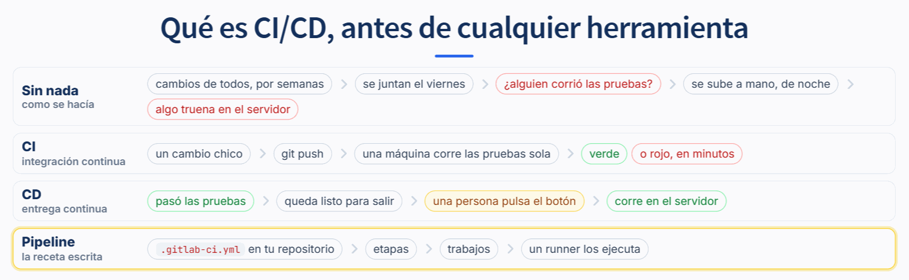
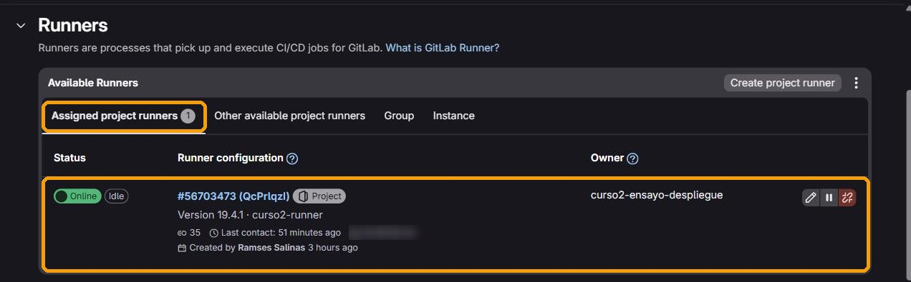
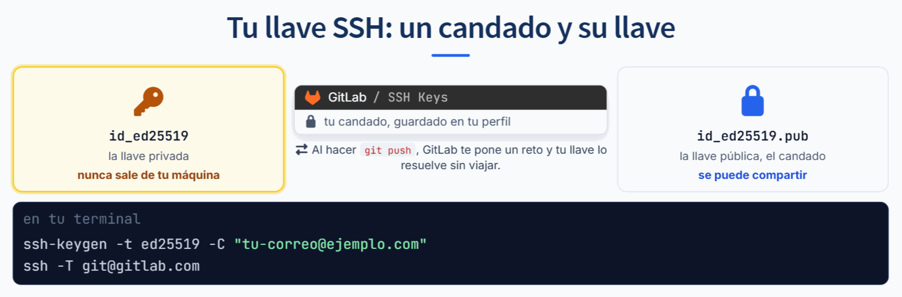
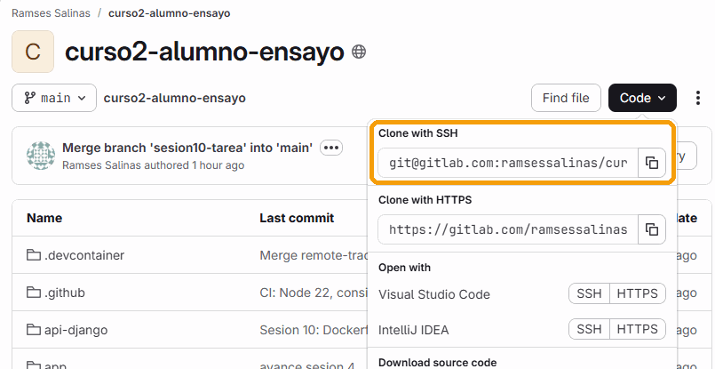
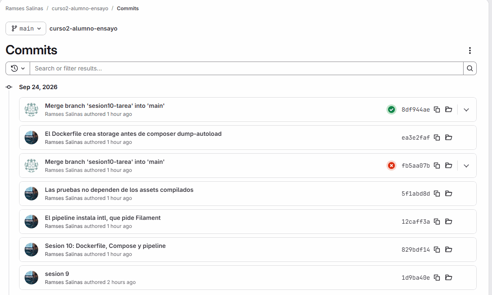
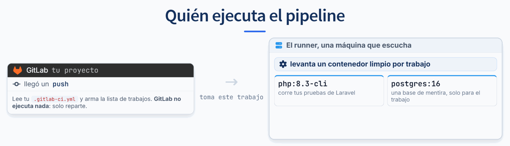
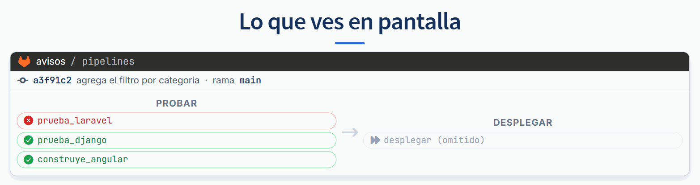

# Guía 03: tu repositorio en GitLab, y tu primer pipeline

Vas a mover tu proyecto a GitLab sin perder un solo commit, y a dejar escritas las reglas que revisan cada cambio que empujes.

Si no hay servidor disponible el día de la clase, **hay camino local** al final de esta guía que da la misma evidencia. El acceso a una infraestructura nunca es parte de la calificación.

---

## Antes de empezar: qué es CI/CD



- **CI, integración continua:** en cada `git push`, una máquina corre tus pruebas sola. Si algo se rompe, lo sabes en minutos y sabes en qué commit.
- **CD, entrega continua:** lo que pasó las pruebas queda listo para salir con un botón. Si saliera solo, sin botón, sería despliegue continuo.
- **Pipeline:** la lista de pasos, escrita en `.gitlab-ci.yml` dentro de tu repositorio. Se divide en **etapas**, cada etapa tiene **trabajos**, y un **runner** los ejecuta.

En esta guía llegas hasta la CI: tu repositorio en GitLab y un pipeline en verde. La CD es la guía 04.

---

## Reto 1: la cuenta y un proyecto vacío

> **Si tu GitLab está en español**, los nombres de esta guía cambian: *Code* es *Código*, *Settings* es *Configuración*, *Clone with SSH* es *Clonar con SSH*. Todo está en el mismo lugar. Si prefieres seguir la guía al pie de la letra, cámbialo en tu foto, **Edit profile**, **Preferences**, sección *Localization*.

### 1. Entra a GitLab

Con la cuenta que creaste en el arranque. Si no la creaste, el paso 5 del arranque dice qué te va a pedir GitLab al registrarte: un código en el correo siempre, y a veces un teléfono.

### 2. Crea el proyecto, y que nazca vacío

Botón **New project**, después **Create blank project**.

- **Project name:** el que quieras, por ejemplo `avisos`.
- **Project URL:** en "Select a group or namespace" escribe tu usuario y elígelo en la sección *Users*. Si eliges un grupo, el proyecto queda en ese grupo y no es tuyo.
- **Visibility Level:** **Public**.
- **Quita la palomita de "Initialize repository with a README".**

Dos de esos puntos tienen razón de ser:

- **Público**, porque el servidor del curso va a clonar tu repositorio para desplegarlo, y uno público lo clona sin llaves. Tu fork de GitHub ya es público: aquí no cambia nada. Lo que sí sigue valiendo es la regla de siempre: tu `.env` nunca entra a Git.
- **Sin README**, porque si el proyecto nace con uno, su primer commit no tiene nada que ver con el tuyo, y cuando empujes tu historia GitLab la va a rechazar porque son dos historias distintas.

### 3. Apaga los runners compartidos

Entra a **Settings**, **CI/CD**, y abre la sección **Runners**. Arriba hay cuatro pestañas: *Assigned project runners*, *Other available project runners*, *Group* e *Instance*. En la pestaña **Instance**, apaga el interruptor **Turn on instance runners for this project**.

Los runners compartidos de GitLab piden una tarjeta de crédito para poder usarse. No los vamos a usar: el pipeline lo va a correr el runner del curso, que no tiene ese requisito ni límite de minutos.

Es lo **único** que haces en esa sección. No crees ni registres ningún runner: los botones *Create project runner* y *Register a project runner* sirven para instalar uno en una máquina propia, y el del curso ya existe. Te lo asigna el instructor en el paso siguiente.

### 4. Invita al instructor

En el menú del proyecto, **Manage**, **Members**, botón **Invite members**. Escribe el usuario de GitLab del instructor y elige el rol **Maintainer**.

Hace falta por una razón concreta: el runner del curso ya existe, y para habilitarlo en tu proyecto hay que ser Maintainer de los dos proyectos, el suyo y el tuyo. En cuanto lo habilite, lo vas a ver en **Settings**, **CI/CD**, **Runners**, pestaña *Assigned project runners*: se llama `curso2-runner` y tiene un punto verde:



### 5. Deja la página abierta

La vas a necesitar en el reto 2: de ahí sale la dirección para empujar y la que mandas a Moodle.

---

## Reto 2: empuja tu historia completa

### 1. Mira lo que tienes

Desde tu proyecto, en la terminal:

```
git remote -v
```

Ahí está `origin`, que apunta a GitHub. **No lo vas a borrar.** Un remoto es solo un nombre con una dirección, y puedes tener varios.

### 2. Tu llave SSH

Para empujar a GitLab, GitLab tiene que saber que eres tú. La forma que no te vuelve a pedir nada es una **llave SSH**: un par de archivos, uno privado que nunca sale de tu máquina y uno público que le das a GitLab.



La pública es como un candado: se puede compartir sin miedo, porque con ella nadie entra. La privada es la llave: si alguien la tiene, puede empujar como si fueras tú.

Se crea igual en Linux, en tu Codespace y en Windows. Cambia solo dónde queda guardada.

**En tu Codespace o en Linux**, en la terminal:

```
ssh-keygen -t ed25519 -C "tu-correo@ejemplo.com"
```

**En Windows**, en PowerShell, el mismo comando. Ya viene instalado en Windows 10 y 11; no hace falta instalar nada.

Te hace tres preguntas. A las tres, **Enter**:

```
Enter file in which to save the key (/home/vscode/.ssh/id_ed25519):
Enter passphrase (empty for no passphrase):
Enter same passphrase again:
```

En Windows la primera dice `C:\Users\tu-usuario/.ssh/id_ed25519`. Si en vez de eso te pregunta `Overwrite (y/n)?`, **contesta `n`**: ya tienes una llave, y la vas a usar tal cual. Si la reemplazas, dejas de entrar a donde ya la usabas.

Al final imprime `Your public key has been saved in ... id_ed25519.pub`. Esa, la que termina en `.pub`, es la pública. Cópiala:

| Dónde estás | Cómo la ves para copiarla |
|---|---|
| Codespace | `code ~/.ssh/id_ed25519.pub`, y la copias del editor |
| Linux | `cat ~/.ssh/id_ed25519.pub` |
| Windows | `Set-Clipboard -Value (Get-Content $env:USERPROFILE\.ssh\id_ed25519.pub)`, y ya queda copiada |

Es **una sola línea** que empieza con `ssh-ed25519`. La otra, `id_ed25519` sin `.pub`, no se copia, no se pega y no se manda a nadie, nunca.

> **Si trabajas en Codespaces:** la llave vive dentro de tu Codespace. Si lo borras o lo creas de nuevo, la llave se va con él y tienes que hacer una nueva. No pasa nada: se repite este paso.

### 3. Dásela a GitLab

En GitLab: tu foto arriba a la derecha, **Edit profile**. En el menú de la izquierda, dentro de **Access**, entra a **SSH keys**. Botón **Add new key**. Pega la línea en *Key*; el *Title* se llena solo con lo que va al final de la línea. Ponle una fecha de caducidad y pulsa **Add key**.

Compruébalo desde la terminal:

```
ssh -T git@gitlab.com
```

La primera vez pregunta si confías en el servidor:

```
Are you sure you want to continue connecting (yes/no/[fingerprint])?
```

Escribe `yes`, completo. Tiene que contestar:

```
Welcome to GitLab, @tu-usuario!
```

### 4. Agrega el nuevo remoto

En la página de tu proyecto, botón **Code**, copia la dirección de **Clone with SSH**. Empieza con `git@gitlab.com:`. El botón de la derecha la copia por ti.



```
git remote add gitlab git@gitlab.com:tu-usuario/avisos.git
git remote -v
```

Ahora salen los dos.

### 5. Empuja todo

```
git push gitlab --all
git push gitlab --tags
```

`--all` manda todas tus ramas locales y `--tags` tus etiquetas. Lo que importa para lo que sigue es `main`.

### Compruébalo

Abre tu proyecto en la web de GitLab y ve a **Code**, **Commits**. Tienen que estar todos tus commits del curso, con sus fechas y sus mensajes originales.

 No se copió nada a mano: es la misma historia de Git en otro servidor.

### Si falla

| Lo que ves | Qué pasa |
|---|---|
| `git@gitlab.com: Permission denied (publickey)` | GitLab no reconoce tu llave. O no la agregaste, o pegaste otra, o te falta la parte que empieza con `ssh-ed25519`. Vuelve a copiar el `.pub` completo. |
| `ssh -T` se queda pensando y termina en `Connection timed out` | La red en la que estás bloquea el puerto 22, lo que es común en redes de oficina. GitLab acepta SSH también por el 443: mira el recuadro de abajo. |
| `Updates were rejected because the remote contains work that you do not have` | El proyecto no nació vacío. Lo más limpio es borrarlo y crearlo otra vez sin README. |
| `fatal: remote gitlab already exists` | Ya lo agregaste antes. Cámbialo con `git remote set-url gitlab <la direccion>`. |
| `Overwrite (y/n)?` al crear la llave | Ya tienes una. Contesta `n` y usa esa. |

> **Si tu red bloquea el puerto 22.** Crea o edita el archivo `~/.ssh/config` (en Windows, `C:\Users\tu-usuario\.ssh\config`, sin extensión) con estas líneas, y repite `ssh -T git@gitlab.com`:
>
> ```
> Host gitlab.com
>   Hostname altssh.gitlab.com
>   User git
>   Port 443
> ```

**Si prefieres no usar SSH**, también se puede por HTTPS: la dirección es la de **Clone with HTTPS**, y cuando pida contraseña va un **token de acceso personal**, no la de tu cuenta. Se crea en **Edit profile**, **Access**, **Personal access tokens**, **Add new token**, con el permiso `write_repository` y una caducidad cercana. En Codespaces este camino suele confundirse con la sesión de GitHub que ya tienes abierta, y por eso aquí va SSH.

---

## Reto 2b: manda la dirección

Sube a **Moodle**, en la actividad **"Entrega Sesión 10: la dirección de tu proyecto en GitLab"**, la dirección de tu proyecto, la que se ve en la barra del navegador. No es la entrega de la tarea y no lleva calificación: es la que hace posible tu alta.

```
https://gitlab.com/tu-usuario/avisos
```

Con eso, el instructor te da de alta en el servidor del curso: habilita el runner en tu proyecto y te prepara tu espacio y tu dirección. Por eso tu proyecto tiene que ser **público** y tenerlo **invitado como Maintainer** antes de mandarla: sin esas dos cosas no puede hacer nada.

Tus cuatro valores para desplegar te llegan en privado. Los usas en la guía 04.

---

## Reto 3: tu primer pipeline

### 1. El archivo más corto que corre algo

En la raíz del proyecto, crea `.gitlab-ci.yml`:

```yaml
stages:
  - probar

construye_angular:
  stage: probar
  image: node:20-alpine
  script:
    - cd frontend
    - npm ci
    - npm run build -- --configuration production
```

Eso es todo. Una etapa, un trabajo, tres comandos.

### 2. Empújalo

```
git add .gitlab-ci.yml
git commit -m "Agrega el pipeline"
git push gitlab HEAD
```

### 3. Míralo correr

En la web de GitLab, menú **Build**, **Pipelines**. Vas a ver tu pipeline con su trabajo.

Quien lo corre no es GitLab: GitLab lee tu archivo y reparte. El que ejecuta es el **runner** del curso, que levanta un contenedor limpio con la `image` que pediste y corre tus comandos adentro.



Dale clic al nombre del trabajo para ver la salida. Es exactamente lo que verías en tu terminal, línea por línea.

### 4. Agrega las pruebas

Ahora agrega el trabajo de Django al mismo archivo, debajo del que ya tienes. El de Laravel llega en la guía 04, porque necesita un par de ajustes que se ven allá:

```yaml
prueba_django:
  stage: probar
  image: python:3.12-slim
  services:
    - name: postgres:16-alpine
      alias: db
  variables:
    POSTGRES_DB: avisos_test
    POSTGRES_USER: prueba
    POSTGRES_PASSWORD: esta_clave_es_de_mentira_y_solo_vive_en_el_pipeline
    DJANGO_SECRET_KEY: clave_de_mentira_solo_para_el_pipeline
    DJANGO_DEBUG: "False"
    DJANGO_ALLOWED_HOSTS: localhost,127.0.0.1,testserver
    DJANGO_DB_NAME: avisos_test
    DJANGO_DB_USER: prueba
    DJANGO_DB_PASSWORD: esta_clave_es_de_mentira_y_solo_vive_en_el_pipeline
    DJANGO_DB_HOST: db
    DJANGO_DB_PORT: "5432"
  before_script:
    - pip install --no-cache-dir -r api-django/requirements.txt "psycopg[binary]==3.2.*"
    - cd api-django
  script:
    - python manage.py migrate --noinput
    - python manage.py test --noinput
```

Mira el `alias: db`. Es el mismo nombre que le pusiste al servicio en tu `compose.yaml`, y por la misma razón: el runner levanta ese contenedor en la misma red del trabajo, y tu código lo alcanza por su nombre.

Y mira las contraseñas: están escritas en el archivo **porque son de mentira**, de una base que nace y muere dentro del trabajo. Las de verdad nunca van aquí.

Empuja otra vez y fíjate en que los dos trabajos corren **al mismo tiempo**: comparten etapa.

Los estados que vas a ver en pantalla:

| Icono | Estado | Qué quiere decir |
|---|---|---|
| Reloj | `pending` | El trabajo existe, pero ningún runner lo ha tomado |
| Círculo que gira | `running` | Un runner lo está corriendo |
| Palomita verde | `passed` | Todos sus comandos terminaron bien |
| Cruz roja | `failed` | Un comando falló. Ábrelo: la última línea roja del log dice cuál |
| Botón de reproducir | `manual` | Espera a que una persona lo pulse. Lo vas a ver en la guía 04 |
| Flecha doble, gris | `skipped` | No corrió porque algo de antes falló |

En la guía 04 vas a ver además el pipeline de `main` entero en **`blocked`**. No es un error: está esperando a que alguien pulse el botón de desplegar.

### Compruébalo

- Tu pipeline sale en verde.
- Sabes decir por qué los dos trabajos corren en paralelo y no uno después del otro.
- Encontraste en el log del trabajo la línea donde corre tu `npm ci`.

### Si falla

| Lo que ves | Qué pasa |
|---|---|
| El pipeline se queda en `Pending` con la etiqueta `stuck` | No hay ningún runner disponible para tu proyecto. **No es tu archivo.** Revisa que invitaste al instructor como Maintainer y que `curso2-runner` ya aparece en *Assigned project runners*. Si el día de la clase no hay runner, salta al camino local de abajo. |
| `This GitLab CI configuration is invalid` | Error de sintaxis. Usa **Build**, **Pipeline editor**, que valida el archivo antes de empujar y te dice la línea. |
| `npm: not found` | La `image` del trabajo no trae Node. Comprueba que pusiste `node:20-alpine`. |
| `could not translate host name "db"` | Falta el bloque `services`, o el `alias` no coincide con lo que usa tu código. |
| El trabajo tarda muchísimo | Cada trabajo empieza con un contenedor limpio, así que descarga las dependencias cada vez. Es normal y tiene arreglo con `cache`, que está en la lectura. |

---

## Reto 4: ponlo rojo a propósito

Un pipeline que nunca se ha puesto en rojo no te ha demostrado nada.

### 1. Rompe un tipo

En cualquier archivo `.ts` de tu Angular, escribe algo que TypeScript no acepte. Por ejemplo, en un componente:

```typescript
  cargando: boolean = "si";
```

### 2. Empuja

```
git add -A
git commit -m "Rompe el tipo a proposito"
git push gitlab HEAD
```

### 3. Búscalo en el log



El trabajo se pone rojo. Ábrelo y busca la línea. Va a decir algo así:

```
error TS2322: Type 'string' is not assignable to type 'boolean'.
```

Fíjate en que te dice el archivo y el número de línea. No hay que adivinar.

### 4. Arréglalo

Déjalo como estaba, empuja y míralo volver a verde.

### Compruébalo

Tienes tres capturas: verde, rojo con la línea del error visible, y verde otra vez. Eso es lo que se pide en la entrega.

---

## Camino local, si no hay runner

Si el pipeline se queda en `pending`, la evidencia se consigue igual. Lo que el pipeline hace es correr comandos; córrelos tú:

```
cd frontend && npm ci && npm run build -- --configuration production && cd ..
docker compose exec django python manage.py test
```

Las pruebas de Laravel no corren dentro de su contenedor: la imagen de producción no lleva la carpeta `tests/` ni las dependencias de desarrollo, a propósito. Córrelas donde siempre, en tu Dev Container o tu Codespace, como en la sesión 6:

```
php artisan test
```

Para la parte de rojo y verde, rompe el tipo igual y corre el build de Angular en tu terminal: el mismo `error TS2322` sale ahí.

Entrega las capturas de tu terminal, y di en tu entrega que fue por el camino local. Vale igual.

---

## Lo que queda para la tarea

Falta la última pieza: que un pipeline en verde termine en una dirección que otra persona pueda abrir. Eso es la guía 04, y es la tarea de esta sesión.
