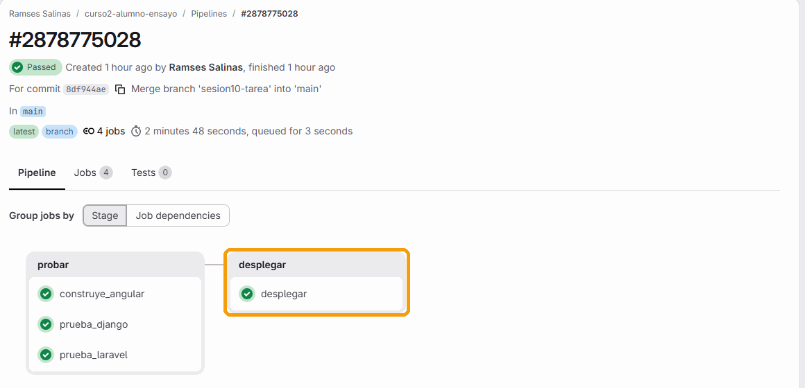
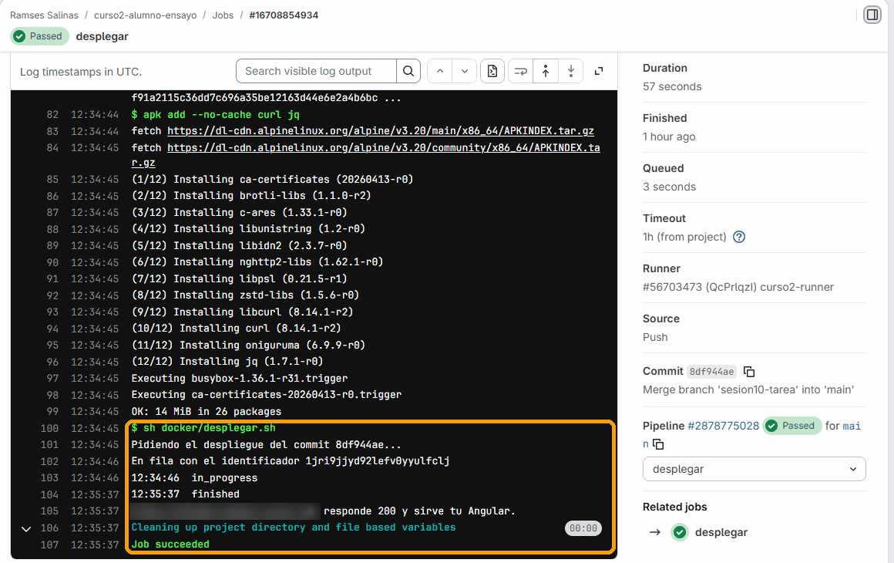
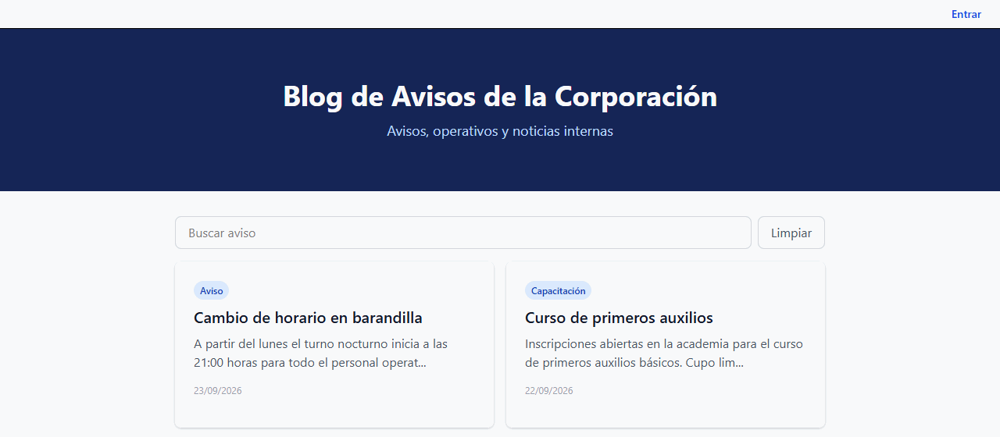
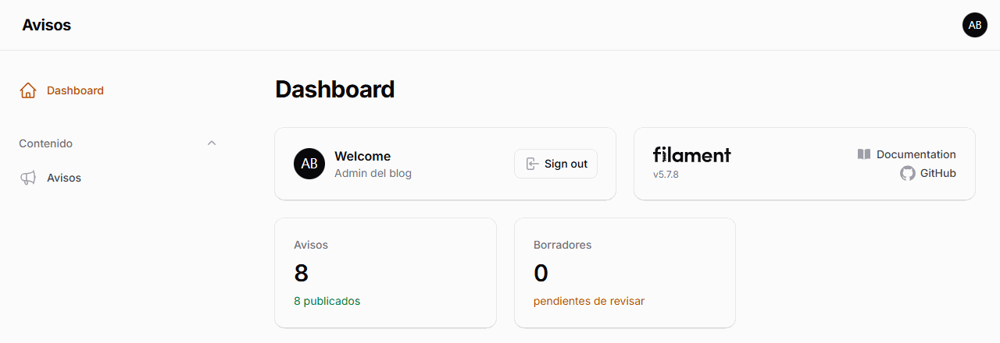
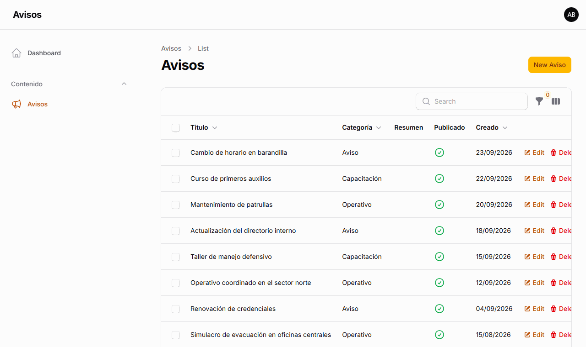
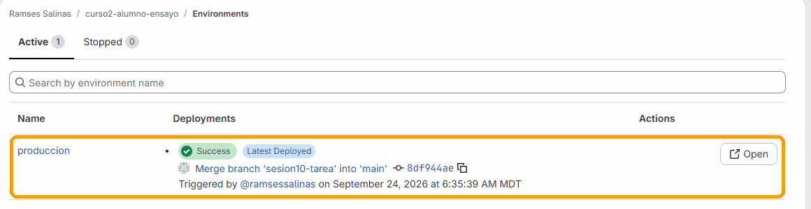

# Guía 04: del pipeline verde a una dirección que se puede abrir

Esta es la guía de la tarea. Al terminar, cuando empujes un cambio a tu rama principal y pulses un botón, tu proyecto entero va a quedar corriendo en el servidor del curso, en una dirección como `https://tunombre.curso.lol` que puedes mandarle a quien sea.

Calcula unas dos horas. Si no hay servidor disponible cuando entregas, la parte 6 tiene el camino equivalente, y vale igual.

---

## Cómo funciona, antes de tocar nada

```
tú           git push a main
GitLab       corre tus tres pruebas en el runner del curso
tú           pulsas el botón de desplegar
el job       le pide al servidor que despliegue tu aplicación
el servidor  clona TU repositorio de GitLab, construye con TUS Dockerfile
             y levanta TU compose.yaml
el job       espera, y queda en verde solo si tu dirección responde
```

Tres cosas que se desprenden de ese dibujo:

- **Tú no entras al servidor.** No hay usuario, ni contraseña, ni terminal. Tu pipeline es tu única puerta, y es a propósito: todo lo que llega al servidor pasó antes por las pruebas.
- **El servidor lee tu repositorio, no tu carpeta.** Lo que no esté en Git no existe allá. Un archivo que olvidaste agregar es el error más común de esta guía.
- **Tu proyecto convive con los de todo el grupo.** Cada uno tiene su red, sus volúmenes y su dirección, y no se ven entre ellos. Pero la máquina es la misma, y eso cambia tres cosas de tu `compose.yaml`: es la parte 1.


### Tus dos direcciones

Cuando alguien abre tu dirección, un proxy en el servidor mira el nombre con el que llegó y la manda a tu contenedor. El candado de HTTPS lo pone ese proxy.


Tu proyecto tiene **dos** nombres, y el instructor te los da en tu alta:

| Dirección | A dónde llega | Qué ves |
|---|---|---|
| `https://tunombre.curso.lol` | Tu `angular` | Tu frontend, que habla con tus dos APIs por `/api/` y `/django/` |
| `https://tunombre-portal.curso.lol` | Tu `laravel`, directo | Tu portal de Blade, y tu panel de Filament en `/admin` |

---

## Lo que ya tienes que tener

De las guías anteriores:

- Los tres `Dockerfile` en `docker/` y tu `compose.yaml` completo.
- Tu repositorio en GitLab, **público**, con toda su historia.
- Los runners compartidos apagados, el instructor invitado como Maintainer, y `curso2-runner` en *Assigned project runners*.
- Un `.gitlab-ci.yml` con los trabajos de prueba, en verde.

Si algo de eso falta, termínalo antes: lo de aquí se construye encima.

---

## Parte 1: tu compose.yaml, listo para una máquina compartida


### 1. Los puertos, fuera

En el servidor viven los proyectos de todo el grupo. Si cada uno publica el 8080, el segundo que despliega falla con el mismo `port is already allocated` que viste en la guía 02. Allá nadie publica puertos: las peticiones de afuera las recibe un proxy, y ese proxy le habla a tu Angular por su nombre, dentro de tu red.

Pero en tu máquina sí quieres abrir `http://localhost:8080`. Compose tiene la solución exacta para eso: un archivo `compose.override.yaml` junto al tuyo. Cuando corres `docker compose up`, Compose lee los dos y los mezcla solo. El servidor solo lee `compose.yaml`.

Crea `compose.override.yaml` en la raíz:

```yaml
# Solo para tu maquina. Compose lo mezcla solo con compose.yaml.
# El servidor NO lo lee: alla los puertos no los publica nadie.
services:
  laravel:
    ports: ["${PUERTO_LARAVEL:-8081}:80"]
  django:
    ports: ["${PUERTO_DJANGO:-8082}:8000"]
  angular:
    ports: ["${PUERTO_ANGULAR:-8080}:80"]
```

Y **borra las tres líneas `ports:`** de tu `compose.yaml`.

### 2. Las migraciones y tus seeders, al arrancar

En tu máquina corrías `php artisan migrate` y `php artisan db:seed`. En el servidor no hay terminal donde escribir eso. Si no corren al arrancar el contenedor, no corren en ningún lado, y tu sitio queda sin datos y sin nadie que pueda entrar al panel.

En el servicio `laravel` de tu `compose.yaml`, agrega:

```yaml
    command: ["sh", "-c", "php artisan migrate --force && php artisan db:seed --force && exec apache2-foreground"]
```

Y en el de `django`:

```yaml
    command: ["sh", "-c", "python manage.py migrate --noinput && exec gunicorn config.wsgi:application --bind 0.0.0.0:8000 --workers 2 --access-logfile -"]
```

El `&&` hace que el servidor web solo arranque si la migración y los seeders salieron bien. Django no lleva seeders en este proyecto, así que ahí solo va `migrate`. El `exec` hace que el servidor web reemplace al `sh`, para que sea él quien reciba la orden de apagarse.

Tus seeders también corren en **cada** despliegue, así que tienen que poder correr dos veces sin duplicar nada. Los del curso ya son así: buscan antes de crear, con `firstOrCreate` y `firstOrNew`. Si agregaste uno que usa `create()` o factories, revisa la tabla de *Si falla*.

> Aquí solo va lo que avanza: `migrate` y seeders que se pueden repetir. Jamás `migrate:fresh`, ni `flush`, ni nada que borre: esa línea corre en **cada** despliegue. Por eso el botón de desplegar es manual. Una migración que borra una columna no tiene vuelta atrás, y la decisión de correrla la toma una persona.

> Un aviso honesto: los usuarios de tus seeders quedan en internet con la clave que está escrita en tu repositorio, que es público, y cada despliegue se las vuelve a poner. En el servidor del curso, que se apaga al terminar, es aceptable. En un sistema real, el primer usuario de producción nunca sale de un seeder con la clave escrita: se crea una sola vez, con una clave que vive en una variable secreta.

### 3. Un tope de memoria por servicio

En una máquina compartida, un contenedor que se come la memoria tumba los proyectos de todos. Con un tope, si el tuyo se pasa, Docker detiene solo el tuyo.

En cada servicio, al mismo nivel que `networks`, con el tope que le toca según la tabla de abajo. Por ejemplo, el de `laravel`:

```yaml
    deploy:
      resources:
        limits: {memory: 384M}
```

Los números que usamos, medidos con el proyecto del curso corriendo:

| Servicio | Tope | Lo que usa en reposo |
|---|---|---|
| `db` | `256M` | unos 30 a 55 MB |
| `laravel` | `384M` | unos 35 a 65 MB |
| `django` | `256M` | unos 95 a 105 MB |
| `angular` | `64M` | unos 5 a 20 MB |

### Compruébalo

> **En PowerShell no existe `grep`.** Donde diga `| grep algo`, escribe `| Select-String algo`, y donde diga `grep algo archivo`, `Select-String algo archivo`. En Mac, Linux y Codespaces, `grep` funciona tal cual.

Lo que va a ver el servidor, solo `compose.yaml`:

```
docker compose -f compose.yaml config | grep published
```

No tiene que imprimir nada. Y lo que ves tú, con los dos archivos:

```
docker compose config | grep published
```

Tienen que salir tus tres puertos. Ahora levanta todo desde cero:

```
docker compose down
docker compose up -d --build
docker compose logs laravel | grep -i migrat
docker stats --no-stream
```

En los logs de Laravel tiene que aparecer `Running migrations` o `Nothing to migrate`, y después `Seeding database.` con tus seeders en `DONE`. En `docker stats` cada contenedor muestra su tope, por ejemplo `64.83MiB / 384MiB`. `http://localhost:8080` abre igual que antes.

### 4. Tus imágenes, listas para vivir detrás de un proxy

En el servidor, el HTTPS lo pone un proxy que está delante de tus contenedores. Dos líneas que ya tienes son las que hacen que eso funcione: una la escribiste en tu Dockerfile de Laravel en la guía 02, y la otra venía en el nginx de la base. Conviene comprobar que están:

```
grep detras-de-proxy docker/laravel.Dockerfile
grep resolver docker/angular.nginx.conf
```

Los dos tienen que imprimir algo.

- **`detras-de-proxy`**, en el Dockerfile de Laravel, le dice a Apache que crea el aviso del proxy de que la visita llegó por HTTPS. Sin ella, Laravel arma las direcciones de su CSS y su JavaScript con `http://`, el navegador las bloquea en una página segura, y tu portal y tu Filament salen sin estilos y sin poder entrar.
- **`resolver`**, en la configuración de nginx de Angular, hace que nginx busque a `laravel` y a `django` en cada petición. Sin ella, nginx se queda con la dirección que tenían al arrancar, y si el servidor recrea uno de los dos, tu Angular responde 502.

Haz commit de los archivos que cambiaste y empuja.

---

## Parte 2: completa el pipeline

### 1. El trabajo de Laravel

Al `.gitlab-ci.yml` que ya tienes, agrega el tercer trabajo de pruebas:

```yaml
prueba_laravel:
  stage: probar
  image: php:8.3-cli
  services:
    - name: postgres:16-alpine
      alias: db
  variables:
    POSTGRES_DB: avisos_test
    POSTGRES_USER: prueba
    POSTGRES_PASSWORD: esta_clave_es_de_mentira_y_solo_vive_en_el_pipeline
    APP_ENV: testing
    DB_CONNECTION: pgsql
    DB_HOST: db
    DB_PORT: "5432"
    DB_DATABASE: avisos_test
    DB_USERNAME: prueba
    DB_PASSWORD: esta_clave_es_de_mentira_y_solo_vive_en_el_pipeline
  before_script:
    - apt-get update && apt-get install -y --no-install-recommends git unzip libpq-dev libzip-dev libicu-dev
    - docker-php-ext-install pdo_pgsql zip intl
    - curl -fsSL https://getcomposer.org/installer -o /tmp/composer-setup.php
    - php /tmp/composer-setup.php --install-dir=/usr/local/bin --filename=composer
    - composer install --no-interaction --prefer-dist --no-progress
    - cp .env.example .env && php artisan key:generate
  script:
    - php artisan migrate --force
    - php artisan test
```

Fíjate en `intl`: la pide Filament, que está en tu proyecto desde la sesión 4. Sin ella, `composer install` se niega a instalar y el trabajo se pone rojo antes de correr una sola prueba. Tu `laravel.Dockerfile` ya la instala; el trabajo del pipeline también tiene que hacerlo, porque corre en su propio contenedor.

Y un cambio en tu código, en `tests/TestCase.php`. Tus vistas usan `@vite`, que busca el CSS y el JS ya compilados en `public/build/manifest.json`. En tu máquina existe porque alguna vez corriste `npm run build`; en el pipeline nadie lo compiló, y la prueba que abre tu portada se cae con un 500. Las pruebas no tienen por qué depender de eso:

```php
abstract class TestCase extends BaseTestCase
{
    protected function setUp(): void
    {
        parent::setUp();
        // Las pruebas no dependen de que alguien haya compilado el CSS y el JS
        $this->withoutVite();
    }
}
```

Empuja y comprueba que los tres trabajos corren en paralelo y quedan en verde. En el runner del curso, con el proyecto del curso, tardan alrededor de 90 segundos Angular, 110 Laravel y 20 Django. Laravel es el lento porque compila sus extensiones en cada pipeline; el extra D, en la guía 05, lo baja a menos de 30.

### 2. La segunda etapa

Arriba del todo ya tienes un bloque `stages:` con una sola etapa. Cámbialo por este, no agregues otro:

```yaml
stages:
  - probar
  - desplegar
```

### 3. El trabajo que despliega

Al final del archivo:

```yaml
desplegar:
  stage: desplegar
  image: alpine:3.20
  # Sin las tres pruebas en verde, este job queda omitido
  needs: [prueba_laravel, prueba_django, construye_angular]
  before_script:
    - apk add --no-cache curl jq
  script:
    # Pide el despliegue y espera: el job queda verde solo si tu sitio responde
    - sh docker/desplegar.sh
  environment:
    name: produccion
    url: $DIRECCION_PUBLICA
  # Un despliegue a la vez: si alguien empuja mientras corre, hace fila
  resource_group: produccion
  rules:
    # Solo desde la rama principal, y solo cuando alguien pulsa el botón
    - if: '$CI_COMMIT_BRANCH == $CI_DEFAULT_BRANCH'
      when: manual
      allow_failure: false
```

`docker/desplegar.sh` ya viene en tu proyecto. Ábrelo y léelo: son cuatro pasos, y todos se pueden leer en voz alta.

1. Le pide al servidor que despliegue tu aplicación, con tu token.
2. El servidor le contesta con un identificador de despliegue.
3. Cada 10 segundos pregunta cómo va ese despliegue, hasta que diga `finished` o `failed`.
4. Cuando dice `finished`, abre tu dirección y comprueba que responde 200 y sirve tu Angular. Que el servidor diga "terminé" no es lo mismo que que tu sitio funcione.

Cinco decisiones del trabajo que vale la pena entender, porque son las que se preguntan en la entrega:

- **`needs`** hace que este trabajo dependa de los tres de prueba. Si uno se pone rojo, este queda omitido.
- **`when: manual`** es la puerta. Las pruebas dicen si *se puede*; el botón dice si *se quiere ahora*, y eso no lo sabe ninguna máquina.
- **`rules` con `$CI_DEFAULT_BRANCH`** hace que solo exista desde tu rama principal.
- **`resource_group`** evita que dos despliegues al mismo destino corran encimados.
- **`environment`** hace que GitLab lleve la cuenta de qué commit está en producción. Lo ves en **Operate**, **Environments**.

---

## Parte 3: las variables, que no van en el archivo

El instructor te da **en privado** cuatro valores. No los pegues en el canal, ni en un commit, ni en una captura.

En tu proyecto de GitLab: **Settings**, **CI/CD**, sección **Variables**, botón **Add variable**. Por cada una eliges la visibilidad, dejas marcada **Protect variable**, escribes el nombre en *Key* y el valor en *Value*, y pulsas **Add variable**. El panel se queda abierto para la siguiente.

| Key | Qué es | Visibility |
|---|---|---|
| `SERVIDOR_URL` | La dirección del servidor de despliegue | Visible |
| `SERVIDOR_UUID` | El identificador de tu aplicación en el servidor | Visible |
| `DIRECCION_PUBLICA` | Tu dirección, por ejemplo `https://tunombre.curso.lol` | Visible |
| `SERVIDOR_TOKEN` | Tu token de despliegue | **Masked and hidden** |

Por qué así:

- **Masked and hidden:** si el token aparece en un log, GitLab lo tapa, y ni siquiera tú lo vuelves a ver en la configuración después de guardarlo. Sin eso, un `echo` distraído lo publica para siempre.
- **Protect variable:** solo se entrega a ramas protegidas. Tu `main` ya nace protegida, así que una rama cualquiera no puede leer la clave de producción.

> Si al guardar el token GitLab dice que no lo puede enmascarar, es por la barra `|` que traen estos tokens, del tipo `12|abcd...`. Pega **solo lo que va después de la barra**. El servidor lo acepta igual.

Lo que ese token puede hacer: pedir despliegues y preguntar cómo van. Lo que no puede: leer los secretos de nadie, ni cambiar la configuración de nada. Y solo funciona desde el runner del curso: si lo usas desde tu máquina, el servidor responde que no tienes permitido usar la API.

---

## Parte 4: el primer despliegue

### 1. Empuja y espera el verde

Empuja a `main`. Cuando las tres pruebas quedan en verde, el trabajo `desplegar` aparece con un botón de reproducir, en la etapa `desplegar`. Después de pulsarlo y de que termine, el pipeline queda así:



Si trabajas con una rama y un merge request, el botón **no** está en el pipeline del merge request: ese solo corre las pruebas. Aparece en el pipeline de `main` que arranca después de unir. Y si pulsas **Merge** mientras las pruebas del merge request siguen corriendo, GitLab no une en ese momento: lo deja en *auto-merge* y une solo cuando quedan en verde.

### 2. Pulsa el botón

Abre el trabajo y mira el log. Así se ve uno de verdad:

```
$ sh docker/desplegar.sh
Pidiendo el despliegue del commit 49bfbd45...
En fila con el identificador 9mhiz99n0yqybv66f4fqaz7l
10:30:19  in_progress
10:30:49  finished
https://tunombre.curso.lol responde 200 y sirve tu Angular.
Job succeeded
```

En la pantalla del trabajo, lo que importa son las últimas líneas:



La primera vez tarda unos 3 minutos, porque el servidor construye tus tres imágenes desde cero. Después, si solo cambiaste código, alrededor de un minuto: es la caché de capas que viste en la guía 01, trabajando en otra máquina.

### 3. Ábrelo

Entra a tu dirección. Tiene candado de HTTPS: el certificado lo sacó el servidor solo, para tu nombre. Si la abres antes de que termine el primer despliegue, el navegador dice *Error de privacidad*: todavía no hay certificado. Espera el verde y recarga.

Tu Angular muestra los avisos de tus seeders, los mismos que en tu máquina. Así se ve la del ensayo del curso, con la sesión del editor iniciada:


Y en tu dirección `-portal`, tu portal de Laravel, sin pasar por Angular. La del ensayo:



En `/admin` entras a Filament con el **admin** de tu `UserSeeder`. Tiene que verse con sus estilos, como en tu máquina:





> Un aviso honesto: ese usuario y su contraseña están escritos en tu repositorio, que es público. En el servidor del curso, que se apaga al terminar, es aceptable. En un sistema real no lo sería, como dice la parte 1.

En GitLab, **Operate**, **Environments**, `produccion` te dice qué commit está desplegado ahora mismo, y tiene un botón para abrirlo:



### 4. Comprueba cada conexión, ahora en el servidor

Son las mismas flechas del reto 2b de la guía 02, con tus direcciones de verdad:

| Abre | Qué debes ver | Qué comprueba |
|---|---|---|
| `https://tunombre.curso.lol` | Tu Angular, con candado | El proxy, el certificado y tu nginx |
| `https://tunombre.curso.lol/api/avisos` | JSON con tus avisos | Angular, Laravel y la base |
| `https://tunombre.curso.lol/django/avisos/?format=json` | `{"count":0, ...}` | Angular, Django y su base |
| `https://tunombre-portal.curso.lol` | Tu portal de Blade, con estilos | El proxy hasta Laravel, directo |
| `https://tunombre-portal.curso.lol/admin` | Filament, con estilos, y que te deje entrar | La línea `detras-de-proxy` |

Y entra en tu Angular con el editor de tu `UserSeeder`, y crea un aviso. Si aparece en la lista y en Filament, las cuatro piezas se están hablando en el servidor igual que en tu máquina.

### 5. Ahora sí: cambia algo

El primer despliegue prueba que la cadena existe. Lo que prueba que es CI/CD es el segundo. Cambia algo que se vea, por ejemplo un texto de tu Angular, haz commit, empuja, espera el verde, pulsa el botón y recarga tu dirección. En el ensayo del curso, del `git push` al sitio cambiado pasaron menos de tres minutos.

### Compruébalo

- Tu dirección abre desde otra computadora o desde tu teléfono, no solo desde tu máquina.
- Tiene HTTPS.
- El cambio que empujaste se ve en tu dirección.
- Puedes crear un aviso y sigue ahí si recargas.
- Tu portal y tu Filament abren con estilos en tu dirección `-portal`.

### Si falla

| Lo que ves en el log | Qué pasa |
|---|---|
| `Vite manifest not found at: .../public/build/manifest.json` y `Expected response status code [200] but received 500` | Una prueba abre una vista con `@vite` y en el pipeline no hay CSS ni JS compilados. Es el `withoutVite()` de la parte 2. |
| `filament/support v5.7.8 requires ext-intl * -> it is missing from your system` | Al trabajo `prueba_laravel` le falta `intl`. Agrégala en el `apt-get install` (`libicu-dev`) y en el `docker-php-ext-install`, como en la parte 2. |
| Tu dirección no responde, y en la parte 6 `docker compose logs laravel` dice `Class "Faker\Factory" not found` | Un seeder usa factories. Faker es una dependencia de desarrollo y la imagen se construye con `--no-dev`, así que en el servidor no existe. Crea esos registros sin factory, con `firstOrCreate`. |
| El primer despliegue funciona y el segundo no; en la parte 6, `duplicate key value violates unique constraint` | Un seeder usa `create()` y la segunda vez choca con lo que ya creó. Cámbialo por `firstOrCreate`. |
| No aparece el botón de desplegar | Estás viendo el pipeline de una rama o de un merge request, o el merge request todavía está en *auto-merge* esperando sus pruebas. El botón solo existe en el pipeline de `main`. No uses el de un pipeline viejo de `main`: el servidor despliega siempre lo último de `main`, así que ese botón podría subir un commit cuyas pruebas todavía no terminan. |
| `falta SERVIDOR_TOKEN en las variables del proyecto` | La variable no existe, o el trabajo corrió en una rama que no está protegida. Las variables protegidas solo llegan a `main`. |
| `{"message":"Unauthenticated."}` | El token está mal pegado. Revisa que no le sobre un espacio, y la nota de la barra de la parte 3. |
| `You are not allowed to access the API.` | La petición no salió del runner del curso. Pasa si corres el script desde tu máquina. |
| `{"message":"No resources found."}` | El `SERVIDOR_UUID` no corresponde a ninguna aplicación. |
| El estado llega a `failed` | El servidor no pudo construir o levantar tu stack. Casi siempre es algo que en tu máquina existe y en el repositorio no. Tu token no alcanza a leer el log del servidor, así que reprodúcelo como lo haría el servidor, con la parte 6: el mismo error sale en tu terminal. Si no tienes Docker a la mano, pide el log en el canal. |
| En la parte 6, el build se cae en `composer dump-autoload` con `Please provide a valid cache path.` | El `mkdir` de las carpetas de `storage` está después de `composer dump-autoload`. Pásalo antes, como en la guía 02: con Filament, `package:discover` ya las necesita. |
| `Termino de desplegar, pero ... no responde bien (codigo 502)` | Un contenedor no arrancó. Lo más común: la migración falló y, por el `&&`, Apache nunca arrancó. Levanta tu clon limpio y mira `docker compose logs laravel`. |
| Tu dirección abre pero las peticiones a `/django/` dan 400 | Django dice `DisallowedHost`: tu dirección no está en `DJANGO_ALLOWED_HOSTS`. Esa la pone el instructor; avísale. |
| Angular carga pero `/api/` da 404 | El nginx no está mandando `/api/` a Laravel. Comprueba que tu imagen se construye con `docker/angular.nginx.conf`. |
| Angular carga pero `/api/` da 502, sobre todo después de un despliegue | nginx se quedó con la dirección vieja de Laravel. Falta la línea `resolver` en tu `docker/angular.nginx.conf`: es la parte 1, paso 4. |
| Tu portal o tu Filament salen sin estilos, o Filament no te deja entrar | Laravel está armando direcciones con `http://` en una página con HTTPS. Falta la línea `detras-de-proxy` en tu Dockerfile de Laravel: parte 1, paso 4. |
| Tu dirección `-portal` no abre, o dice *Error de privacidad* después del despliegue | Tu portal no tiene nombre en el servidor todavía. Lo da de alta el instructor; avísale. |
| Angular abre pero no hay avisos | Los seeders no corrieron. Revisa que tu `command` de Laravel lleve `php artisan db:seed --force`, como en la parte 1. |
| Funciona y al rato se cae | Se pasó del tope de memoria. En tu máquina, `docker stats` te dice cuál. |
| El trabajo se queda en `Pending` con `stuck` | El runner del curso no está habilitado en tu proyecto. Es la guía 03, reto 1, paso 4. |

---

## Parte 5: lo que ves y lo que no

Tú no ves los logs del servidor. Tu ventana es el trabajo `desplegar`: te dice si terminó, si falló y si tu dirección responde. Es una limitación real de este montaje, y en un sistema de producción se resuelve con herramientas que juntan los logs de todos los contenedores en un solo lugar.

Lo que sí tienes es algo mejor para aprender: **tu repositorio reproduce exactamente lo que hace el servidor**. Si el servidor falla, tu clon limpio falla igual, y ese sí lo puedes ver entero. Si aun así necesitas el log del servidor, pídelo al instructor con tu UUID y la hora del despliegue.

---

## Parte 6: camino equivalente, y la prueba de lo que ve el servidor

Si no hay servidor cuando entregas, **esto vale igual**. Y aunque lo haya, es la forma de reproducir un `failed`.

La idea es levantar tu proyecto como lo haría el servidor: **sin tu carpeta de trabajo**, desde una copia limpia del repositorio.

```
cd ..
git clone https://gitlab.com/tu-usuario/avisos.git prueba-despliegue
cd prueba-despliegue
cp .env.example .env
```

Tu `.env` no viajó en el clon, y eso está bien: es lo que se quiere. Pega al final de este `.env` nuevo el contenido de `docker/variables.env.example`, y cambia ahí tres cosas para que esta copia no choque con la que ya tienes corriendo:

- **`COMPOSE_PROJECT_NAME`**: otro nombre, por ejemplo `avisos-tunombre-limpio`. Con el mismo nombre, Compose cree que es el mismo proyecto: reemplaza tus contenedores y reusa tu volumen, que tiene la clave vieja, y la migración falla con `password authentication failed`.
- **Los tres `PUERTO_*`**: otros números, por ejemplo `9080`, `9081` y `9082`.
- **`BD_CLAVE` y `DJANGO_SECRET_KEY`**: claves nuevas.

Falta `APP_KEY`. Aquí no sirve `php artisan key:generate`: esta copia todavía no tiene `vendor/`, y en la terminal de tu computadora quizá ni haya PHP. Pídesela a un contenedor, con la imagen de PHP que ya descargaste:

```
docker run --rm php:8.3-apache php -r "echo 'base64:'.base64_encode(random_bytes(32)).PHP_EOL;"
```

Imprime una línea que empieza con `base64:`. Pégala completa en la línea `APP_KEY=` de tu `.env`. Después:

```
docker compose up -d --build
docker compose ps
docker compose logs laravel
```

Las migraciones y tus seeders corren solos al arrancar. Si aquí falta un archivo, es que no lo subiste, y es exactamente lo que le pasó al servidor.

Cuando termines, `docker compose down -v` dentro de `prueba-despliegue` borra esta copia con su volumen. Tu proyecto de trabajo no se toca: es otro nombre de proyecto.

Entrega las capturas y di en tu entrega que fue por este camino.

---

## Lo que se entrega

Lee la tarea de la sesión: ahí están los cuatro puntos y cómo se evalúa cada uno. En resumen:

1. Tus `Dockerfile`, tu `compose.yaml` y tu `compose.override.yaml` en el repositorio, levantando desde una copia limpia.
2. Tu repositorio en GitLab con su historia, y las capturas del pipeline.
3. Tu dirección abierta con un cambio que empujaste tú, o la prueba del camino equivalente.
4. Media cuartilla sobre qué se pierde si el servidor se apaga ahora mismo.

El cuarto punto es el que más se piensa y el que menos se escribe. Vale lo mismo que los otros tres.
