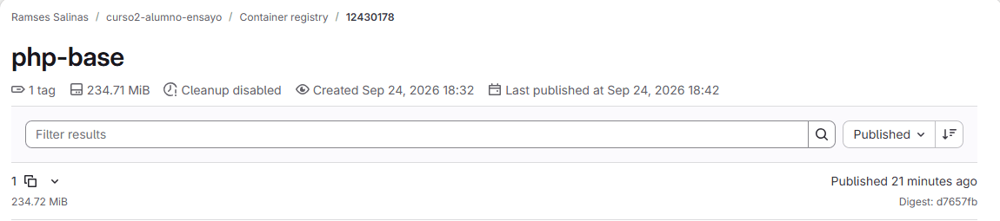
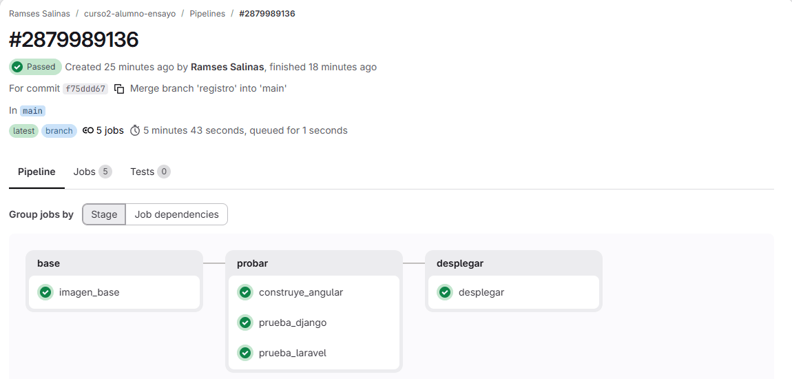

# Guía 05, extra: tu base de PHP en el registro de GitLab

Esta guía es para quien ya terminó la guía 04 y quiere ir más lejos. **No tiene peso en la calificación.** Es el extra D de la tarea.

Al terminar, tu pipeline va a construir **una sola vez** una imagen con PHP, sus extensiones y Composer, la va a guardar en el registro de imágenes de tu proyecto, y tanto la prueba de Laravel como el servidor la van a descargar en lugar de compilar todo otra vez.

Calcula una hora. Unos diez minutos de eso son esperar a que corra el pipeline.

---

## Lo que se gana, medido

Se ensayó con el proyecto real de un alumno, en el mismo runner del curso que usas tú:

| | Antes | Después |
|---|---|---|
| Trabajo `prueba_laravel` | 110 a 114 s | **24 a 29 s** |
| Tiempo de runner de las tres pruebas, por pipeline | 225 s | **131 s** |
| Trabajo nuevo, `imagen_base` | no existe | 3 a 4 min, **solo** cuando cambias la base |
| Trabajo `desplegar` | 58 s | 58 s |

Y lo que **no** se gana, dicho claro:

- **El despliegue tarda lo mismo.** El servidor ya tenía esas capas en su caché desde tu segundo despliegue. La ganancia está en el pipeline, donde cada trabajo arranca en un contenedor limpio y antes compilaba todo cada vez.
- **Tu pipeline completo baja menos de lo que parece.** Las tres pruebas corren en paralelo, y ahora la que más tarda es la de Angular, unos 87 s. Si además haces el extra A, la caché de npm, baja esa también.
- **Tu imagen de producción pesa unos 80 MB más**, porque la base trae `git`, que Composer usa en las pruebas.

¿Entonces para qué? Porque el runner es uno para todo el grupo y corre tres trabajos a la vez. Cuando todos empujan al mismo tiempo, lo que decide cuánto esperas en la fila es cuánto runner ocupa cada pipeline, y eso bajó casi a la mitad. Y porque ahora tus pruebas corren sobre **la misma base** que tu servidor, con las mismas extensiones.

---

## Cómo funciona, antes de tocar nada


Un **registro de imágenes** es una tienda de imágenes, como Docker Hub. GitLab le da uno a **cada proyecto**, y ya lo tienes aunque nunca lo hayas abierto.

- **Subir** una imagen se dice **push**. En tu proyecto solo puede subir tu pipeline, o tú.
- **Bajarla** se dice **pull**. Tu proyecto es público, así que cualquiera la puede bajar sin contraseña, y eso incluye al servidor del curso.
- Cada imagen tiene un **nombre** y una **etiqueta**: `registry.gitlab.com/tu-usuario/avisos/php-base:1`. El nombre dice de qué proyecto es; la etiqueta, qué versión.

### Por qué la base y no la imagen completa

Un sistema grande sube su imagen **completa** en cada commit, con la etiqueta del commit, y el servidor ya no construye: solo descarga esa versión exacta. Aquí hacemos algo más chico a propósito:

- **La base es lo que más tarda y lo que casi nunca cambia.** Tu código cambia en cada commit; las extensiones de PHP, casi nunca.
- **El camino del despliegue no cambia.** El servidor sigue construyendo con tu `laravel.Dockerfile`, como en la guía 04. Solo que ahora empieza desde tu base en lugar de empezar desde cero.
- **La base no lleva tu código ni ninguna clave.** Es solo el ambiente. Por eso puede vivir en un registro público sin problema.

### Por qué no `docker build`

Si buscas cómo construir imágenes en GitLab, casi todo lo que encuentras usa `docker build` dentro del pipeline. En el runner del curso **no funciona**, y es a propósito: cada trabajo corre en un contenedor que no tiene acceso al Docker del servidor. Dárselo sería darle a cualquier trabajo de cualquier alumno el control de la máquina entera, con los proyectos de todo el grupo adentro.

Por eso se usa **Kaniko**: un programa que construye una imagen a partir de un Dockerfile **sin necesitar Docker**, desde un contenedor normal. El Kaniko original, de Google, se archivó en 2025; aquí se usa una copia que mantiene la comunidad, `ghcr.io/osscontainertools/kaniko`. En el ensayo del curso se probaron otras dos herramientas que hacen lo mismo, Buildah y BuildKit sin root, y las dos fallan en este runner.

---

## Lo que ya tienes que tener

- La guía 04 terminada: tu pipeline en verde y tu dirección desplegada.
- Tu proyecto de GitLab **público**, como lo creaste en la guía 03. Si es privado, el servidor no puede bajar tu base y el despliegue falla.

---

## Parte 1: la base

### 1. Una rama

Todo esto va en una rama con su merge request, para que el pipeline lo pruebe antes de llegar a `main`. Y se empuja a `gitlab`, el remoto que agregaste en la guía 03, no a `origin`, que sigue siendo GitHub:

```
git switch -c registro
```

### 2. El Dockerfile de la base

Crea `docker/php-base.Dockerfile`:

```dockerfile
# La base de PHP de tu proyecto: lo que tarda en compilarse, hecho una sola vez.
#
# El pipeline la construye solo cuando cambia este archivo y la guarda en el
# registro de imagenes de tu proyecto en GitLab. La usan dos: la prueba de
# Laravel del pipeline y tu docker/laravel.Dockerfile. Asi las dos tienen
# exactamente las mismas extensiones, y ninguna las vuelve a compilar.
#
# Si le cambias algo, sube tambien el numero de la etiqueta (php-base:1, :2...)
# en los tres lugares donde aparece.
FROM php:8.3-apache
RUN apt-get update && apt-get install -y --no-install-recommends \
        git unzip libpq-dev libzip-dev libicu-dev \
    && docker-php-ext-install pdo_pgsql zip intl opcache \
    && rm -rf /var/lib/apt/lists/*
COPY --from=composer:2 /usr/bin/composer /usr/bin/composer
```

Línea por línea:

- `FROM php:8.3-apache`: la misma imagen de la que ya parte tu `laravel.Dockerfile`. Trae Apache, y también PHP de línea de comandos, así que las pruebas pueden correr en ella.
- `apt-get install`: las librerías de siempre, más `git`, que Composer usa al instalar en el pipeline.
- `docker-php-ext-install`: las cuatro extensiones de tu Dockerfile de Laravel. **Esta es la parte lenta**, la que ya no se va a repetir.
- `COPY --from=composer:2`: Composer, igual que en tu Dockerfile.

No hay un solo `COPY` de tu proyecto. Esa es la idea.

---

## Parte 2: el trabajo que la construye

### 1. Una etapa nueva, antes de probar

Arriba de tu `.gitlab-ci.yml` ya tienes un bloque `stages:`. Cámbialo por este, no agregues otro:

```yaml
stages:
  - base
  - probar
  - desplegar
```

Las etapas corren en orden, así que la base siempre queda lista antes de que empiecen las pruebas.

### 2. El trabajo `imagen_base`

Antes de tu `prueba_laravel`:

```yaml
# Construye la base de PHP y la sube al registro de imagenes del proyecto.
# Kaniko construye sin necesitar un runner privilegiado, que en un servidor
# compartido le daria a cualquier trabajo el control de toda la maquina.
# Solo corre cuando cambia docker/php-base.Dockerfile: el resto del tiempo,
# las pruebas y el servidor reusan la que ya esta guardada.
imagen_base:
  stage: base
  image:
    name: ghcr.io/osscontainertools/kaniko:v1.28.5-debug
    entrypoint: [""]
  script:
    - mkdir -p /kaniko/.docker
    - echo "{\"auths\":{\"${CI_REGISTRY}\":{\"auth\":\"$(printf "%s:%s" "${CI_REGISTRY_USER}" "${CI_REGISTRY_PASSWORD}" | base64 | tr -d '\n')\"}}}" > /kaniko/.docker/config.json
    - /kaniko/executor
      --context "${CI_PROJECT_DIR}"
      --dockerfile "${CI_PROJECT_DIR}/docker/php-base.Dockerfile"
      --destination "${CI_REGISTRY_IMAGE}/php-base:1"
  rules:
    - changes: [docker/php-base.Dockerfile]
```

Qué hace cada parte:

- **`kaniko:v1.28.5-debug`**: la variante `debug` trae una terminal, y GitLab la necesita para correr tu `script`. Sin `-debug`, el trabajo se cae antes de empezar. La versión va fija para que tu pipeline no cambie solo el día que salga otra.
- **`entrypoint: [""]`**: la imagen de Kaniko arranca por defecto construyendo. Con esto arranca vacía, y GitLab corre tus comandos.
- **La línea larga del `echo`**: escribe el archivo con el que Kaniko se presenta ante el registro para poder subir. Parece complicada, pero solo arma un JSON con un usuario y una contraseña. Cópiala entera, con todas sus comillas y barras.
- **`CI_REGISTRY`, `CI_REGISTRY_USER`, `CI_REGISTRY_PASSWORD` y `CI_REGISTRY_IMAGE`**: no las creas tú. GitLab las pone solas en cada trabajo, y la contraseña solo vale mientras dura ese trabajo. `CI_REGISTRY_IMAGE` es el nombre de tu proyecto en el registro, ya en minúsculas: `registry.gitlab.com/tu-usuario/avisos`.
- **`/kaniko/executor`**: construye con `--dockerfile`, desde tu proyecto como `--context`, y sube el resultado a `--destination`.
- **`rules: changes:`**: el trabajo solo corre si el commit cambió el archivo de la base. La primera vez corre porque el archivo es nuevo.

### 3. La prueba de Laravel, sobre la base

En tu `prueba_laravel` cambian dos cosas. La imagen:

```yaml
prueba_laravel:
  stage: probar
  # La misma base que tu imagen de produccion: mismas extensiones, nada que compilar
  image: ${CI_REGISTRY_IMAGE}/php-base:1
```

Y el `before_script`, que se queda con dos líneas de seis. Esto se va, porque ya viene en la base:

```yaml
    - apt-get update && apt-get install -y --no-install-recommends git unzip libpq-dev libzip-dev libicu-dev
    - docker-php-ext-install pdo_pgsql zip intl
    - curl -fsSL https://getcomposer.org/installer -o /tmp/composer-setup.php
    - php /tmp/composer-setup.php --install-dir=/usr/local/bin --filename=composer
```

Y esto se queda:

```yaml
  before_script:
    - composer install --no-interaction --prefer-dist --no-progress
    - cp .env.example .env && php artisan key:generate
```

Los `services`, las `variables` y el `script` no se tocan.

---

## Parte 3: empuja y mira tu registro

```
git add docker/php-base.Dockerfile .gitlab-ci.yml
git commit -m "La base de PHP sale del registro de GitLab"
git push -u gitlab registro
```

Abre el merge request. Su pipeline ahora tiene una etapa más, al principio. `imagen_base` tarda de 3 a 4 minutos, y al final de su log tiene que decir algo así:

```
INFO[0148] Pushing image to registry.gitlab.com/tu-usuario/avisos/php-base:1
INFO[0189] Pushed registry.gitlab.com/tu-usuario/avisos/php-base@sha256:d7657fb9...
Job succeeded
```

En cuanto termina, arrancan las pruebas. Abre `prueba_laravel`: ya no hay `apt-get` ni compilación. Arranca directo en `composer install`, y termina en menos de 30 segundos.

Ahora mira tu registro. En el menú de la izquierda de tu proyecto: **Deploy**, **Container registry**. Ahí está `php-base`, y adentro, su etiqueta `1`:



El botón de copiar que está junto al `1` te da el nombre completo de tu imagen. Lo vas a usar en la parte 4.

### Compruébalo

- `imagen_base` está en verde y su log termina en `Pushed`.
- `prueba_laravel` está en verde, sin compilar nada, en menos de 30 segundos.
- En **Deploy**, **Container registry** aparece `php-base` con la etiqueta `1`, de unos 235 MiB.

---

## Parte 4: que el servidor también la use

Hasta aquí, solo las pruebas usan tu base. Ahora tu imagen de producción.

En `docker/laravel.Dockerfile`, la etapa 2 hoy empieza así:

```dockerfile
# Etapa 2: PHP con Apache. Una sola imagen que ya sabe servir Laravel.
FROM php:8.3-apache
RUN apt-get update && apt-get install -y --no-install-recommends \
        libpq-dev libzip-dev libicu-dev unzip \
    && docker-php-ext-install pdo_pgsql zip intl opcache \
    && a2enmod rewrite \
    && echo 'SetEnvIf X-Forwarded-Proto "^https$" HTTPS=on' > /etc/apache2/conf-available/detras-de-proxy.conf \
    && a2enconf detras-de-proxy \
    && sed -ri 's!/var/www/html!/var/www/html/public!g' /etc/apache2/sites-available/000-default.conf \
    && rm -rf /var/lib/apt/lists/*
COPY --from=composer:2 /usr/bin/composer /usr/bin/composer
```

Cámbiala por esto, con **tu** nombre de imagen, el que copiaste del registro:

```dockerfile
# Etapa 2: la base de PHP de tu proyecto, que ya trae las extensiones y Composer.
# Sale del registro de imagenes de tu proyecto en GitLab: docker/php-base.Dockerfile
FROM registry.gitlab.com/tu-usuario/avisos/php-base:1
RUN a2enmod rewrite \
    && echo 'SetEnvIf X-Forwarded-Proto "^https$" HTTPS=on' > /etc/apache2/conf-available/detras-de-proxy.conf \
    && a2enconf detras-de-proxy \
    && sed -ri 's!/var/www/html!/var/www/html/public!g' /etc/apache2/sites-available/000-default.conf
```

Lo que se fue ya viene en la base: las librerías, las extensiones y Composer. Lo que se quedó es lo que es de Apache: la reescritura de direcciones, la línea `detras-de-proxy` de la guía 02 y la carpeta `public`. Todo lo que sigue abajo, desde `WORKDIR`, no se toca.

> **El nombre va en minúsculas**, aunque tu usuario de GitLab tenga mayúsculas. Si lo escribes a mano y se te va una, Docker contesta `repository name ... must be lowercase`. Por eso conviene copiarlo del registro.

Empuja a la misma rama:

```
git add docker/laravel.Dockerfile
git commit -m "La imagen de Laravel parte de la base del registro"
git push gitlab registro
```

Espera el verde del merge request y únelo. En el pipeline de `main`, `imagen_base` corre una vez más, porque para `main` el archivo también es nuevo. A partir de ahí ya no, hasta que cambies la base:



Pulsa el botón de desplegar. En el ensayo tardó lo mismo que antes, 58 segundos.

### Compruébalo

- `desplegar` en verde, con tu dirección respondiendo `200`.
- Tu Angular muestra los avisos, como en la guía 04.
- Tu portal y tu Filament abren **con estilos** en tu dirección `-portal`. Si no, se perdió la línea `detras-de-proxy` al cambiar la etapa 2.

---

## Parte 5: el día que cambies la base

Si un día le agregas algo a `php-base.Dockerfile`, por ejemplo otra extensión, **sube la etiqueta** de `1` a `2` en los tres lugares donde aparece, en el mismo commit:

1. `--destination` en `imagen_base`.
2. `image:` en `prueba_laravel`.
3. `FROM` en `docker/laravel.Dockerfile`.

¿Por qué no dejar el `1` y ya? Porque el runner del curso guarda una copia de cada imagen que ya bajó, y si el nombre y la etiqueta son los mismos, **no vuelve a preguntar**. El servidor sí pregunta. Si cambias la base sin cambiar la etiqueta, tus pruebas corren sobre la base vieja y tu servidor construye sobre la nueva: justo lo que querías evitar.

En el ensayo del curso pasó exactamente eso. La base se subió dos veces con la misma etiqueta, una desde el merge request y otra desde `main`. El runner se quedó con la primera y el servidor construyó con la segunda. Aquí no importó porque las dos salieron del mismo archivo, pero con un cambio de verdad, las pruebas habrían dicho verde sobre algo que no es lo que se despliega.

### Limpiar

Cada etiqueta ocupa unos 235 MiB en tu proyecto. Cuando ya despliegues con la `2` y todo esté en verde, borra la `1` desde la página del registro, con el menú que está a la derecha de la etiqueta. No la borres antes: mientras tu `main` diga `:1`, las pruebas y el servidor la siguen pidiendo.

---

## Si falla

| Lo que ves | Qué pasa |
|---|---|
| `imagen_base` se cae apenas empieza, antes de correr tu primer comando | Usaste la imagen de Kaniko sin `-debug`, que no trae terminal, o falta `entrypoint: [""]`. |
| `imagen_base`: `error checking push permissions` | Kaniko no se pudo presentar ante el registro. Casi siempre es la línea del `echo` copiada a medias: le falta una comilla o una barra. Cópiala otra vez completa. |
| `imagen_base` no aparece en el pipeline | Es lo normal cuando el commit no cambió `docker/php-base.Dockerfile`: tu base ya está en el registro y se reusa. |
| `prueba_laravel`: `failed to resolve reference ".../php-base:2": ... not found` | Esa etiqueta no existe en tu registro. O subiste el número sin cambiar `php-base.Dockerfile` en el mismo push, y entonces `imagen_base` no corrió, o `imagen_base` falló. Revisa el registro: ahí está qué etiquetas tienes. |
| Cambiaste la base y las pruebas se portan como antes | No subiste la etiqueta: el runner sigue con su copia vieja. Es la parte 5. |
| `desplegar` llega a `failed` después de cambiar el `FROM` | El servidor no pudo bajar tu base. Pruébalo en tu máquina con `docker pull` y el nombre exacto de tu `FROM`: si falla ahí, falla allá, y el mensaje te dice por qué. |
| En tu máquina: `repository name ... must be lowercase` | Hay una mayúscula en el nombre de la imagen. Cópialo del registro. |
| En tu máquina: `error from registry: access forbidden` | Ese proyecto no existe con ese nombre, o es privado y nadie puede bajar su base sin contraseña. Revisa la ruta y que tu proyecto sea público. |
| Tu portal o tu Filament salen sin estilos después del cambio | Se perdió la línea `detras-de-proxy` de la etapa 2. Va en el `RUN` que se quedó, no en la base. |
| Tu computadora es una Mac con chip Apple y el build de Laravel se queja de la plataforma | La base se construyó para el procesador del servidor, no para el tuyo. Al servidor no le afecta. Si en tu máquina falla, dilo en el canal con la captura. |

---

## Lo que se entrega

Este extra no suma ni resta. Si lo haces y quieres que se vea, agrega a tu entrega:

1. La captura de tu registro, con `php-base` y su etiqueta.
2. Dos capturas del trabajo `prueba_laravel`, una de antes y otra de después, donde se lea cuánto tardó.
3. Tu dirección funcionando después del cambio del `FROM`, con tu portal con estilos.
4. Unas líneas contestando dos preguntas:
   - Tu base vive en un registro que cualquiera puede descargar. ¿Qué **no** debe llevar nunca una imagen que va a un registro así, y por qué tu base cumple?
   - Si cambias la base y no subes la etiqueta, ¿sobre qué base corren tus pruebas y sobre cuál construye el servidor? ¿Por qué es un problema aunque todo salga en verde?
