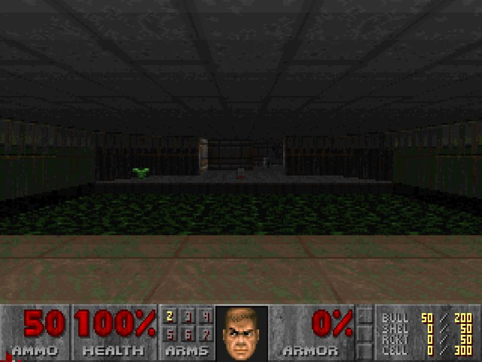

# Antes de la sesión 10: deja Docker listo

Son cinco pasos. Los cuatro primeros tardan más en descargar que en hacerse, y por eso conviene no dejarlos para el día de la clase: si doce personas descargan lo mismo a la misma hora en la misma red, la clase empieza mirando barras de progreso.

Calcula unos 20 minutos, casi todos de espera.

---

## 1. Instala Docker Desktop

Ve a [docker.com](https://www.docker.com/products/docker-desktop/) y descarga **Docker Desktop** para tu sistema.

**En Windows.** El instalador necesita WSL 2. Normalmente lo activa él solo; si te pide reiniciar, reinicia antes de seguir. Si te pregunta entre WSL 2 y Hyper-V, elige WSL 2.

**En Mac.** Hay dos descargas distintas: una para chip Intel y otra para chip Apple. Si bajas la que no es, la aplicación no abre. Si no sabes cuál tienes, en el menú de la manzana, "Acerca de esta Mac", dice el chip.

Al terminar, **abre Docker Desktop y déjalo abierto**. Ese programa es el que hace el trabajo: si está cerrado, la terminal no responde.

## 2. Comprueba que quedó

Abre una terminal **de tu computadora**, no la del Dev Container ni la de un Codespace. En Windows, PowerShell. En Mac, Terminal.

```
docker version
```

Tiene que salir un bloque `Client` y **también** un bloque `Server`, más o menos así:

```
Client:
 Version:           29.6.2
 ...
Server: Docker Desktop 4.85.0
 Engine:
  Version:          29.6.2
```

Tus números pueden ser otros. Si solo sale `Client` y debajo un error, Docker Desktop no está abierto: el cliente, que es lo que escribes, está bien; el servicio que hace el trabajo, no.

```
docker run hello-world
```

Descarga una imagen chica y la corre. Cuando termine imprime un texto que empieza con "Hello from Docker!". Si llegaste aquí, ya está todo lo que necesitas.

## 3. Descarga las imágenes de la clase, con tiempo

Estas siete las vamos a usar en vivo. Descargarlas antes es la diferencia entre empezar a la hora y empezar veinte minutos tarde.

```
docker pull elliottking/doom-wasm:0.1.1
docker pull node:20-alpine
docker pull nginx:1.27-alpine
docker pull postgres:16-alpine
docker pull python:3.12-slim
docker pull php:8.3-apache
docker pull composer:2
```

La primera pesa **448 MB** y es la más lenta. Las demás juntas pesan algo parecido.

> **Si tu Mac tiene chip Apple**, Docker avisa que la plataforma de la imagen de DOOM (`linux/amd64`) no coincide con la tuya. Es un aviso, no un error: la corre igual, emulada y un poco más lenta.

Si quieres comprobar que la primera sirve, córrela:

```
docker run --rm -p 8000:8000 elliottking/doom-wasm:0.1.1
```

Abre `http://localhost:8000` en el navegador. Tarda unos segundos en cargar, y se ve así:



Se juega con el teclado: flechas para moverte y `Ctrl` para disparar. Para apagarlo, `Ctrl` y `C` en la terminal donde lo corriste.

> Si el puerto 8000 lo ocupa otra cosa en tu máquina, cambia el número de la **izquierda**: `-p 8090:8000`, y abre `http://localhost:8090`.

## 4. Trae lo nuevo del curso a tu repositorio

Lo de siempre, desde tu proyecto:

```
git add -A
git commit -m "Lo que llevo de la sesion 9"
git fetch upstream
git merge --no-edit upstream/main
git push origin HEAD
```

Con esto aparecen una carpeta `docker/` y un `compose.yaml` de esqueleto. No los toques todavía: los completas en clase.

## 5. Crea tu cuenta de GitLab

Hazlo antes de la clase: la verificación puede tardar, y en clase no hay tiempo de esperar un mensaje.

1. Ve a [gitlab.com](https://gitlab.com), **Register**, y llena nombre, usuario, correo y contraseña. Usa tu correo de siempre, no uno temporal.
2. **El usuario va a quedar en la dirección de tu proyecto** (`gitlab.com/tu-usuario/...`), y es lo que vas a mandar en la entrega. Elige uno que no te dé pena compartir.
3. GitLab te manda un **código de verificación al correo**. Escríbelo donde te lo pide. Eso se lo pide a todos.
4. A algunas cuentas les pide además **un teléfono**, al que manda otro código por SMS. Depende de una evaluación de riesgo que hace GitLab al registrarte, no de algo que hayas hecho mal. Cada teléfono solo sirve para una cuenta.
5. Al entrar te hace unas preguntas de bienvenida: qué haces y para qué lo quieres. Contesta lo que sea. Si te ofrece **crear un grupo** o **probar un plan de pago**, sáltalo: para el curso no hace falta ninguno de los dos.

**No crees ningún proyecto todavía.** En clase lo creamos juntos, y tiene que nacer de una manera concreta para que tu historia de Git entre sin pelearse.

> **Si al registrarte te pide una tarjeta de crédito, no la pongas.** Es el nivel más alto de esa evaluación de riesgo y le pasa a pocas cuentas. Avísalo en el canal antes de la clase: hay camino sin GitLab, y vale lo mismo.

---

## Si algo falla

| Lo que ves | Qué pasa y qué hacer |
|---|---|
| `docker: command not found` | La terminal no encuentra Docker. Cierra la terminal y ábrela otra vez: al instalar, la ruta se agrega a las terminales nuevas, no a las que ya estaban abiertas. |
| `Cannot connect to the Docker daemon` | Docker Desktop no está abierto, o todavía está arrancando. Ábrelo, espera a que el icono deje de moverse y repite. |
| `docker version` solo muestra `Client` | Lo mismo de arriba: el cliente está bien, el servicio no. |
| En Windows: `WSL 2 installation is incomplete` | Falta reiniciar, o falta el paquete de WSL. Reinicia primero. Si sigue, corre `wsl --update` en PowerShell y vuelve a intentar. |
| En Windows: `Hardware assisted virtualization ... not enabled` | Hay que activar la virtualización en la BIOS. Si el equipo es institucional y no puedes entrar, avísalo en el canal antes de la clase, no el día de. |
| En Mac: `The application can't be opened` | Bajaste la descarga del otro chip. Borra e instala la que corresponde. |
| `port is already allocated` | Otra cosa de tu máquina ocupa ese puerto. Cambia el número de la izquierda del `-p`. El de la derecha no se toca. |
| `no space left on device` | Se llenó el disco de Docker. `docker system df` te dice qué ocupa, y `docker system prune` borra lo que no está en uso. Lee lo que te pregunta antes de decir que sí. |
| La descarga va lentísima | Es la red, no tu máquina. Por eso este paso va antes de la clase. |

Si te trabas en cualquier punto, escribe al canal del curso **con la captura del error completo**, no solo la última línea. Casi siempre la razón está tres renglones más arriba.

---

## Para llegar con ventaja

La lectura **`00-docker-y-gitlab-por-dentro.md`** cuenta por escrito todo lo que vemos en clase. No hace falta leerla entera antes, pero si la lees, la sesión te va a cundir mucho más: vas a llegar con las preguntas hechas en vez de tomando notas.
